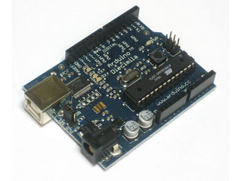
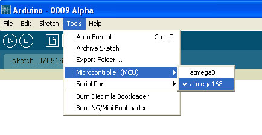
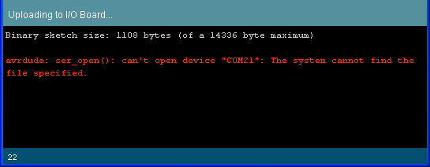

Introduction

Ah yes, it is finally time to make your Arduino do something! We're going to start with the [classic **hello world!**](http://en.wikipedia.org/wiki/Hello_world) of electronics, a blinking light.

This lesson will basically get you up and running using the Arduino software and uploading a sketch to the Arduino board. Once you've completed this step we can continue to the really exciting stuff, which is when we start writing our own sketches!

These instructions mostly show Windows software. Except when indicated, the software (should be) identical on all platforms. Linux will be added once I figure out how to get it working (yay)

Do you have everything you need?

Not much is needed for this lesson, just a USB cable and an Arduino. If you have an older Arduino you may also need an LED. Any LED is fine as long as it looks sorta like the photo, with a plastic bulb and two legs

Make sure you've gone through [Lesson 0](lesson0.html) first!

Assembled Arduino board, preferrably a Diecimila (or whatever the latest version is)

[Adafruit](http://www.adafruit.com/index.php?main_page=product_info&cPath=17&products_id=50)

$35

USB Cable. Standard A-B cable is required. Any length is OK.

[Adafruit](http://www.adafruit.com/index.php?main_page=product_info&products_id=62)

Or any computer supply store

$5

LED - **Optional**  
Nearly any LED is OK, as long as it has two wire legs. This part is only required for **NG rev c** Arduinos (and maybe other older ones). Diecimila Arduino's have this part 'built-in'

Any electronics supply store

$1

Download the Software

The first thing to do is download the Arduino software.

Go to the [Arduino Software Download page](http://www.arduino.cc/en/Main/Software) and grab the right file for your OS. As of Sept 2007 the version is **009** but you should use whatever is most recent.

The packages are quite large, 30-50 MB so it may take a while to finish

Unpack and Install

Extract the package onto the Desktop

  
Windows

  
Mac OS X

  
Windows

  
Mac OS X

Startup!

Double click the Arduino software icon

  
Windows

  
Mac OS X

To open up the workspace

I think I get the red error text shown because I already have Arduino installed. Either way, it isn't a problem if you do or don't see it.

Select chip

The first step is to configure the Arduino software for the correct chip. Almost all Arduinos use the ATmega168, but there's a chance you have an ATmega8\. Look for the chip on the Arduino that looks like this:

  

If the text says ATMEGA8-16P then you have an **atmega8** chip. If the text says ATMEGA168-20P then you have an **atmega168** chip. If it says "ATMEGA328P-20P" you have an **atmega328p** chip

Make sure the correct chip is selected (this picture is really old, will be fixed soon). This preference is saved so you only have to set it once, the program will remember next time it's run.

Select port

Next, its time to configure the Serial Port (also known as the COM Port). Go back to [lesson 0](lesson0.html) to remind yourself of which port it is. On a PC it will probably be something like **COM3** or **COM4**. On a Mac it will be something like **tty.usbserial-xxxxx**

  
Windows port selection

  
Mac port selection

This preference is saved so you only have to set it once, the program will remember next time it's run.

However, if you have multiple Arduino's, they may be assigned difference COM ports. So every time you plug in a new Arduino, double check that the correct port is selected.

Open blink sketch

**Sketches** are little scripts that you can send to the Arduino to tell it how to act. Let's open up an **Example Sketch**. Go to the **File menu -> Sketchbook -> Examples -> Digital -> Blink**

The window should now look like this, with a bunch of text in the formerly empty white space and the tab **Blink** above it

Verify / Compile

The first step to getting a **Sketch** ready for transfer over to the arduino is to **Verify/Compile** it. That means check it over for mistakes (sort of like editing) and then translate it into an application that is compatible with the Arduino hardware.

After a few seconds, you should see the message **Done compiling.** in the **Status Bar** and **Binary Sketch Size:** in the **Notification area.** This means the sketch was well-written and is ready for uploading to the Arduino board!

Reset (NG only)

To tell the Arduino that it should prepare itself for a new Sketch upload, you must reset the board. Diecimila Arduino's have built-in auto-reset capability, so you don't need to do anything. Older Arduinos, such as NG, must be manually reset before uploading a sketch. To do that simply press the black button on the right hand side of the board, shown here.

Upload

Now it's time to upload. Make sure the Arduino is plugged in, the green light is on and the correct Serial Port is selected.

If you have an NG Arduino, press the **Reset Button** now, just before you select the **Upload** menu item.

Select **Upload to I/O Board** from the **File menu**

****

After a few seconds you should get this screen, with the message **Done uploading.** in the status bar.

If you get the following error message "**avrdude: stk500_getsync(): not in sync: resp=0x00"** that means that the Arduino is not responding

Then check the following:

*   If you have a NG Arduino, did you press reset just before selecting **Upload** menu item?
*   Is the correct Serial Port selected?
*   Is the correct driver installed?
*   Is the chip inserted into the Arduino properly? (If you built your own arduino or have burned the bootloader on yourself)
*   Does the chip have the correct bootloader on it? (If you built your own arduino or have burned the bootloader on yourself)

If you get the following error message:

It means you dont have a serial port selected, go back and verify that the correct driver is installed ([lesson 0](lesson0.html))and that you have the correct serial port selected in the menu.

If you get the following error **Expected signature for ATMEGA**

Then you have either the incorrect chip selected in the **Tools** menu or the wrong bootloader burned onto the chip

If you get the following error: can't open device "COM10": The system cannot find the file specified (under Windows, COM port value may vary)

It means that you have too many COM ports (maybe you've got 9 Arduinos?) You should make sure that the port is numbered as low as possible. You can use a program like [FTClean](http://www.ftdichip.com/Resources/Utilities.htm) to clear out old COM ports you aren't using anymore. Once you've cleaned out the ports, you'll have to reinstall the driver again (see lesson 0).  
Alternately, if you're sure that the ports are not used for something else but are left over from other USB devices, you can simply change the COM port using the **Device Manager**. Select the USB device in the Device Manager, right click and select **Properties**

Then click **Advanced**... and in the next window change the COM port to something like **COM4** or **COM5**. Don't forget to select the new port name in the Arduino software. The lower port names may say **(in use**) but as long as the other USB devices aren't plugged in, it shouldn't be a problem. This is a little riskier than just using FTClean...

Video of all steps

Here is a video showing the timing of the steps described so far.

   

Insert LED (NG Arduinos)

Some older Arduinos don't have a built in LED, its easy to tell if yours does or not

If you have a Diecimila or other Arduino with a built in LED you will see a translucent part as shown

If you have an NG rev C or other Arduino without an LED, the translucent part will not be there, and instead you will see two silver dots

If you don't have an LED, you'll need to add your own. Any LED will do, as long as it has two legs and kinda looks like the one shown here. LEDs are **directional** components. That means if you put it in backwards it will not work! To help you put the LED in right, the LED factory cuts the legs at different lengths. The longer leg goes in the hole marked **13** and the shorter one goes in the hole marked **GND**

Watch!

If you have a Diecimila Arduino, the upload process is quite fast, just start the Upload from the software. The board will automatically reset itself, transfer the sketch and start the sketch. The little translucent LED will start blinking

  
[Click To Play](http://blip.tv/file/get/Ladyada-DiecimilaArduinoBlinkUpload640.flv)

play_blip_movie_386213();

If you have an NG arduino, make sure the LED is inserted as indicated before. Here is a video of the entire uploading process. Right after I press the Reset Button I start the sketch upload. There is a short wait while the software prepares to transfer the sketch. Then the two small orange lights blink, indicating the sketch is being transfered. When its done, there is a 7 second delay until the sketch starts.

  
[Click To Play](http://blip.tv/file/get/Ladyada-ArduinoNGUploadBlink905.mp4)

play_blip_movie_386202();

If you don't get a blinking LED, make sure you put the part in the right way, in the correct holes, and perhaps try a different LED as it may be bad.