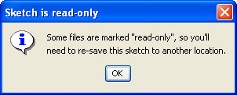
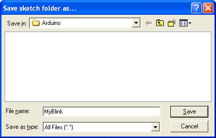
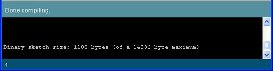
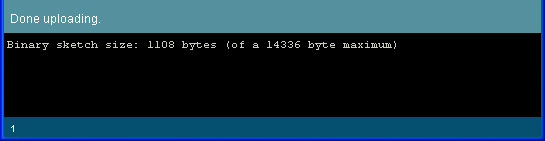

# Lesson 2: Blink blink bLiNk BLINK

## Introduction

OK you've gotten your Arduino set up and also figured out how to use the software to send sketches to the board. Next step is to start writing your own sketches. We'll start off easy by just modifying something that already works.

To start we will venture deep into the Blink sketch, looking at each line and trying to understand what its doing.

Then we will start hacking the sketch!

## Blinkie

Start up the Arduino software and open the Blink example sketch, as you did in [Lesson 1](lesson1.md).

The sketch itself is in the text input area of the Arduino software. Sketches are written in text, just like a document. When you select **Compile/Verify** from the menu, the Arduino software looks over the document and translates it to Arduino-machine-language - which is not human-readable but is easy for the Arduino to understand.

Sketches themselves are written in C, which is a programming language that is very popular and powerful. It takes a bit of getting used to but we will go through these examples slowly.

```c
 /*
 * Blink
 *
 * The basic Arduino example.  Turns on an LED on for one second,
 * then off for one second, and so on...  We use pin 13 because,
 * depending on your Arduino board, it has either a built-in LED
 * or a built-in resistor so that you need only an LED.
 *
 * https://www.arduino.cc/en/Tutorial/Blink
 */

int ledPin = 13;                // LED connected to digital pin 13
void setup()                    // run once, when the sketch starts
{
  pinMode(ledPin, OUTPUT);      // sets the digital pin as output
}

void loop()                     // run over and over again
{
  digitalWrite(ledPin, HIGH);   // sets the LED on
  delay(1000);                  // waits for a second
  digitalWrite(ledPin, LOW);    // sets the LED off
  delay(1000);                  // waits for a second
}
```

## Comments

Lets examine this sketch in detail starting with the first section:

```c
/*
 * Blink
 *
 * The basic Arduino example.  Turns on an LED on for one second,
 * then off for one second, and so on...  We use pin 13 because,
 * depending on your Arduino board, it has either a built-in LED
 * or a built-in resistor so that you need only an LED.
 *
 * https://www.arduino.cc/en/Tutorial/Blink
 */
```

This is a **comment**, it is text that is not used by the Arduino, its only there to help humans like us understand whats going on. You can tell if something is a comment because there is a **/\*** at the beginning and a **\*/** at the end. Anything between the / _and_ / is ignored by the Arduino. In this example the person who wrote the comment decided to make it look pretty and add \*'s down the side but this isn't necessary. Comments are very useful and I strongly encourage every sketch you make have a comment in the beginning with information like who wrote it, when you wrote it and what its supposed to do.

## Variables

Lets look at the next line:

`int ledPin = 13; // LED connected to digital pin 13`

This is the first line of actual instruction code. It is also extremely unlike English \(or any other human language\). The first part we can easily understand is the part to the right, which is also a comment. Turns out if you want to make a small comment, you can use **//** as well as / __/. // is often used for short, one line comments.

The rest of the line, the stuff before the //, is what is called a **statement**, which is basically like a computerized sentence. Much like human sentances end with a . \(period\), all computer sentences end with a ; \(semicolon\)

OK all we have left is the statement itself, which turns out to be a sentence telling the computer that we would like it to create a box named **ledPin** and to put the number 13 in that box. If you remember your math, you may recall that the box is also known as variable.

| **box-type** | **box-name** | = | **stuff-to-put-in-box** |
| :---: | :---: | :---: | :---: |
| `int` | `ledPin` | `=` | `13` |

The first part of this sentence is `int`, which is short for **integer** which is a fancy way of saying whole number.

The second part of this sentence is `ledPin` which is the name of the box.

The third part is an `=`, which basically says that the variable \(box\) named `ledPin` should start out equaling whatever is after the `=`. The fourth part is 13, a whole number \(integer\) which is assigned to `ledPin`.

## Procedures

Lets move on to the next section

```c
void setup()                    // run once, when the sketch starts
{
  pinMode(ledPin, OUTPUT);      // sets the digital pin as output
}
```

OK we've got two comments, each starting with //. We understand comments already so lets skip that. We also see in the middle there is a statement, we know its a statement because it ends with a `;` \(semicolon\) however there's a whole bunch more stuff before and after it. This bunch of code is an example of a **procedure**, a procedure is a collection of statements, its used to group statements together so that we can refer to them all with one name. Its just like a procedure that we use to perform a task step by step.

| **returned value** | **procedure name** | \(input values\) | **{ statements }** |
| :---: | :---: | :---: | :---: |
| void | setup | \(\) | { pinMode\(ledPin, OUTPUT\); } |

To better understand procedures, lets use an analogy to the kinds of procedures we're used to

```text
clean cat wash the cat(dirty cat)                    // a procedure for washing the cat
{
    turn on the shower.
    find the cat.
    grab the cat.
    put cat under shower.
    wait 3 minutes.                                     // wait for cat to get clean.
    release cat.
}
```

This is a procedure for washing the cat. The name of the procedure is **wash the cat**, it uses a _dirty cat_ as the input and returns a _clean cat_ upon success. There are two brackets, an open bracket { and a closed bracket }, thats are used to indicate the beginning and end of the procedure. Inside the procedure are a bunch of statements, indicating the correct procedure for washing a cat. If you perform all of the statements then you should be able to turn a dirty cat into a clean cat.

Looking again at the procedure, we see that it is named `setup` and it has no input values and it returns **void**. Now you're probably asking yourself "what is `void`?" Well thats a computer-scientist way of saying **nothing**. That is, this procedure doesnt return anything. \(That doesnt mean it doesn't do anything, just that it doesn't have a tangible number or whatever, to show when its complete\)

`void setup() // run once, when the sketch starts`

There is one statment in this procedure,

`pinMode(ledPin, OUTPUT); // sets the digital pin as output`

We'll return to this statement in detail later, suffice to say it is a way of telling the Arduino what we would like to do with one of the physical pins on the main processor chip.

## Procedure calls

We're onto the next bunch of text.

```c
void loop()                     // run over and over again
{
  digitalWrite(ledPin, HIGH);   // sets the LED on
  delay(1000);                  // waits for a second
  digitalWrite(ledPin, LOW);    // sets the LED off
  delay(1000);                  // waits for a second
}
```

Using our now well-honed technique we recognize that the text to the right is all comments. We also recognize another procedure, this one called **loop** which also has no inputs or output. This procedure has multiple statements, one after the other.

We're going to skip the first statement for now and go straight to statement \#2.

The second and fourth statements are the same, and have something to do with a **delay**. This statement is very similar to the "wait 3 minutes." command in our cat-washing procedure. This statement says "Dear Arduino. Stop what you're doing for a short amount of time. Thanks!" To do this, the statement performs a _procedure call_. \(We will use the phrasing _calls a procedure_\). Basically, we want the Arduino to take a break but don't quite know how to do it, lucky for us, someone else wrote a procedure called **delay** which we can _call upon_ to do the work for us. Kind of like if we need to do our taxes and we dont know how, we call upon an accountant to do it for us, giving them the paperwork input and getting tax return as the result.

| **procedure name** | \(input values\) | **;** |
| :---: | :---: | :---: |
| delay | \(1000\) | ; |

This means that somewhere out there, there's a procedure something like this:

```text
void delay(number of milliseconds)
{
  "Dear Arduino. Stop what you're doing for **(number of milliseconds)** amount of time. Thanks!"
}
```

\(Of course, this example is not proper code\)

Turns out this `delay` procedure works pretty well, and all we have to do is tell it how many milliseconds \(1/1000th of a second\) to wait and it will do the job for us.

Returning to the first statment, we see that it is also a procedure call. This time for some procedure called `digitalWrite`. We'll also skip this one in detail for a bit, except to explain that its turning a pin on the Arduino chip on and off, and that pin is powering the LED so in essence its turning the LED on and off.

## Special Procedures - Setup\(\) and Loop\(\)

I do want to mention quickly here that the two procedures we've mentioned so far are extra-special in that when the Arduino first wakes up after being reset, it always does whats in the `setup` procedure first. Then it does whatever is in the `loop` procedure over and over and over...forever! Or at least until you turn it off.

## Modifying the example

Now that we've analyzed the entire program it's time to make some changes. In your Arduino software, change the number in the **delay** procedure calls to 500 \(from 1000\) as shown

```c
void loop()                     // run over and over again
{
  digitalWrite(ledPin, HIGH);   // sets the LED on
  delay(500);                  // waits for a second
  digitalWrite(ledPin, LOW);    // sets the LED off
  delay(500);                  // waits for a second
}
```

If you try to save the sketch, you'll get the warning that it's _read-only_.



Not a big deal, you can save it under a new name, such as `MyBlink`



Compile/Verify the sketch and Upload it, using your [Lesson 1](https://github.com/bmsa-cs/LadyAda-Arduino-Tutorials/tree/0229aba967c64040fd37b249b90f53855c7030bd/lesson1.html) techniques.





Once the Arduino has been updated with the new sketch you should see a faster-blinking light than before

If the LED is not blinking faster, check:

* Did you make the changes to the `delay` procedure call to make it 500?
* Did the compile/verify complete successfully? \(should look like the screenshot above\)
* Did the upload complete successfully? \(should look like the screenshot above\)

## Exercises

Now it time for you to make modifications to the sketch and experiment with different delay values

### Exercise 1

Modify the code so that the light is on for 100 msec and off for 900 msec\*\*

### Exercise 2

Modify the code so that the light is on for 50 msec and off for 50 msec. What happens?

Intense strobe action!

### Exercise 3

**Modify the code so that the light is on for 10 ms and off for 10 ms. What happens?**

The light is no longer blinking

**Now pick up the Arduino and gently wave it back and forth, in a dark room. What happens?**

The LED creates a dashed trail of light in the air.

**What do you think is happening here?**

The LED is blinking, but its blinking so fast that our eyes can't pick it up, so it looks like a blur. When the Arduino is waved in the air, we see streaks of light from the blinks.

## Wrap up

Congrats, you have finished the second lesson!

In this lesson you examined the Blink sketch in detail, and learned a bit of the language used to talk to the Arduino. You also learned how to modify a sketch, and practiced uploading sketches to the Arduino some more.

