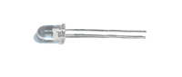
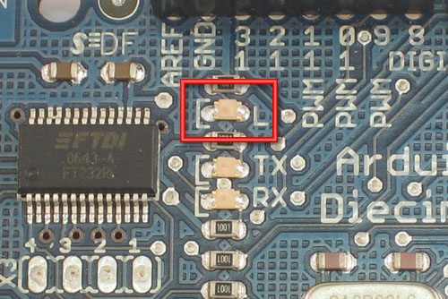

# Lesson 3: LEDs

## Introduction

You've started modifying sketches, and played a bit with the onboard LED \(or if you have an NG, an LED you added\). The next step is to start adding onto the hardware component of the Arduino. We will do this by adding a [solderless breadboard](https://en.wikipedia.org/wiki/Solderless_breadboard) to our setup, connecting up new parts with wire.

## Get your gear

| Image | Item | Location | Price |  |
| :---: | :---: | :---: | :---: | :--- |
| [](https://github.com/bmsa-cs/LadyAda-Arduino-Tutorials/tree/0229aba967c64040fd37b249b90f53855c7030bd/images/attiny2313dip.jpg) | Assembled Arduino board, preferably a Diecimila \(or whatever the latest version is\) but NG is OK too | [Adafruit](https://www.adafruit.com/index.php?main_page=product_info&cPath=17&products_id=50) | $35 |  |
| [](https://github.com/bmsa-cs/LadyAda-Arduino-Tutorials/tree/0229aba967c64040fd37b249b90f53855c7030bd/images/10MHzcermosc.jpg) | USB Cable.   Standard A-B cable is required. Any length is OK. | [Adafruit](https://www.adafruit.com/index.php?main_page=product_info&products_id=62) | Or any computer supply store | $5 |
|  | LEDs   For this lesson, a red, green and blue LED are best. Make sure you get a "5mm" or "3mm" LED, with two legs, as shown in the example image. "Ultrabright" LEDs \(1000 mcd rating or higher\) are preferred | Any electronics supply store |  |  |
|        | Three 1KΩ Resistors \(brown black red gold\)   Any values from 300 Ω to 2KΩ are probably OK. | Any electronics supply store | $1 |  |
|  | Arduino Prototyping Shield with tiny breadboard | [Adafruit](https://www.adafruit.com/index.php?main_page=product_info&cPath=17&products_id=51) + [Adafruit](https://www.adafruit.com/index.php?main_page=product_info&cPath=18&products_id=65) | $15/$7.50 |  |
| [](https://github.com/bmsa-cs/LadyAda-Arduino-Tutorials/tree/0229aba967c64040fd37b249b90f53855c7030bd/images/breadboard-half.jpg) | Standard solderless breadboard  If you don't have a protoshield, this is a substitute | [Adafruit](https://www.adafruit.com/index.php?main_page=product_info&cPath=18&products_id=64) | $5 |  |
|  | Hookup Wire  Get 22 gauge solid-core wire in red, black and some other color. Make sure its _not_ stranded wire! | Any hardware store |  |  |

## Say hello to the solderless breadboard!

Solderless breadboards are an important tool in your quest for electronics mastery. They allow you to make quick circuits, test out ideas before making a more permanent Printed Circuit Board. They're also inexpensive and reusable.. You can pick on up at any hobby shop or electronics supply store. They often look like this

[](https://github.com/bmsa-cs/LadyAda-Arduino-Tutorials/tree/0229aba967c64040fd37b249b90f53855c7030bd/images/halfbb.jpg)

Basically, a chunk of plastic with a bunch of holes. However, something special is going on inside the breadboard! Although you can't see it, inside the breadboard are many strips of metal that connect the rows and columns together. The metal strips are springy so that when you poke a wire into the hole, the clips grab onto it.

[](https://github.com/bmsa-cs/LadyAda-Arduino-Tutorials/tree/0229aba967c64040fd37b249b90f53855c7030bd/images/bbunderside.jpg)

In the images above you can see how there are two kinds of metal strips. There are short ones that connect 5 row holes at a time, and then there are very long ones that connect 25 \(or more!\) column holes at a time. The long columns are called **rails** and the short strips are called **rows**. Breadboards are almost always made so that they have two sets of 5-hole rows and on either side there are a pair of rails. For example the breadboard on the left has 30 row pairs and 2 sets of double rails on either side. The one on the right is quite small, it has only 17 row pairs and no rails.

In this lesson, we will show pictures of both the tiny breadboard on a protoshield and also using a 'standard' breadboard without a shield. However, after this lesson, you'll be more on your own to figure out how to connect up the standard breadboard, OK?


**Warning!**

Distressing as it may sound, solderless breadboards can be **very** flakey, especially as they age. If you're having problems with your circuit, it could be that the little metal clips on the inside aren't working well. Try poking it with your finger, or moving it to a different section.


## Say hello to wires!

To use the breadboard, you'll need jumper wires. These are basically 22 gauge solid-core \(not stranded\) wires that are cut down and have the insulation pulled off. You can use a fingernail or, best of all, a [real wirestripper tool](https://www.ladyada.net/library/equipt/kits.html) to remove the insulation, just takes a few tries and then it's really easy.

Heres how to do it with just diagonal cutters...Cut the wire first, using wire cutters

[](https://github.com/bmsa-cs/LadyAda-Arduino-Tutorials/tree/0229aba967c64040fd37b249b90f53855c7030bd/images/jumpercut.jpg)

Nick the insulation, then pull it off.

[](https://github.com/bmsa-cs/LadyAda-Arduino-Tutorials/tree/0229aba967c64040fd37b249b90f53855c7030bd/images/jumpernick.jpg)

[](https://github.com/bmsa-cs/LadyAda-Arduino-Tutorials/tree/0229aba967c64040fd37b249b90f53855c7030bd/images/jumperstrip.jpg)

To connect rows together, just stick the wire ends without insulation into the square holes!

[](https://github.com/bmsa-cs/LadyAda-Arduino-Tutorials/tree/0229aba967c64040fd37b249b90f53855c7030bd/images/jumper.jpg)

Now is a good time to practice making jumpers, go forth and make a few 3" long jumpers!

## Say hello to the resistor!

The resistor is the most basic and also most common electronic part. An electronic gadget, such as an mp3 player has easily a _thousand_ resistors inside of it!


_Behold...a resistor!_

Resistors have one job to do, and that is to _resist_ the flow of electricity \(otherwise known as **current**\). That's why they're called resistors. By resisting current they control where and how fast it flows. One common way of thinking about this is if we were talking about water current, then pipes are like resistors. Thin pipes let less water through \(high resistance\), thick pipes let a lot of water through \(low resistance\). With a fire hydrant, you want low resistance. With a water fountain, you'd want high resistance. If you mixed up the two pipe sizes, you wouldn't be able to put out a fire and [you'd hurt yourself while trying to get a drink.](https://hacks.mit.edu/Hacks/by_year/1991/fire_hydrant/)

Resistance is measured in **ohms**, often written as the symbol **Ω**. The bigger the resistance value \(in ohms\) the more it fights. Most [resistors](https://en.wikipedia.org/wiki/Resistor) you'll see range between 1 ohm and 1 megaohm \(1.0 MΩ\). Since the resistive element is inside a ceramic casing, it's not possible to tell the resistance of a resistor just by looking at it. You'll have to read it by looking at the colored stripes on the body of the resistor. This is known as the **resistor color code**, and it's a real pain when you first start electronics. Eventually you'll get really good at telling the value of a resistor just by glance but to start off you'll want to use a reference chart. \([Or you can use a multimeter to measure the resistance accurately](https://learn.adafruit.com/multimeters/resistance)\)

[Click here to view a reference chart that you can print out](https://github.com/bmsa-cs/LadyAda-Arduino-Tutorials/tree/0229aba967c64040fd37b249b90f53855c7030bd/images/metertutorial/rescolorcode.jpg) \(in color\) and use as your guide. There are also [website calculators that you may find very handy](https://resistorcolorcodecalc.com/)

**Remember:** Just because the stripes are in a certain order doesn't mean the resistor has a direction! Resistors are the same forward and backwards, it doesn't matter which way they are used.

### Quick quiz!



**What is the color code for a 5% 1.0KΩ resistor?**



Brown - Black - Red - Gold





**What is the color code for a 5% 220Ω resistor?**



Red - Red - Brown - Gold





**What is the value of this resistor?**

      



The stripes are yellow \(4\) - violet \(7\) - red \(\* 100\) = 4700 Ω = 4.7KΩ





**What happens if you put a resistor in backwards?**



Ha! Trick question, it is not possible to put a resistor in 'backwards'. They work either way!




**Note on Wattages...**

In all these examples, we use 1/4W resistors. Unless otherwise noted you can use 1/16 W or 1/2W or whatever you can get your hands on. Higher wattage resistors are larger and usually more expensive, but sometimes your local hobby shop will only have 1/2W.


## Say hello to the LED!

We've had some time with the LED already, but lets get to know her a little better. The word LED stands for **Light Emitting Diode**. The light-emitting part, well, that makes sense. We've used the LED to make a blinking light in lessons 1 and 2. The LED component turns current into light, much like any sort of light bulb. But what is this mysterious diode?

[A diode](https://en.wikipedia.org/wiki/Diode) is basically a one-way street for current. Imagine such a one-way street with a traffic policeman in front. If you want to turn onto the street the wrong way, he will not let you. Likewise the diode simply does not let current go through it the wrong way. Current in a diode can only flow from the **positive** side to the **negative** side.

If you recall from [lesson 1](lesson1.md), Arduino NG users had to make sure that they inserted the LED in the right way. If you place the LED in backwards it won't work. Diecimila Arduino users already have the LED \(a very very small one\) soldered onto the circuit board the right way.



_Look again! Its a tiny LED_

As we mentioned before, its easy to figure out which side of an LED is positive and which one is negative. The positive leg is slightly longer and if you look inside, the chunk of metal is larger on the negaive side.


## Light up my breadboard

We're going to now use the breadboard to light up an LED. You will need a breadboard, an LED and a 1.0K ohm resistor \(brown black red gold\). If you have a protoshield, [make sure its assembled first](https://learn.adafruit.com/adafruit-proto-shield-arduino). Then, place the tiny breadboard on top. You can remove the backing to stick it on \(which is permanent\) or you can just use double-sided tape. If you have a regular breadboard you'll need 2 jumper wires as well.


**Important Note!**

While LEDs will not work when placed backwards, you don't have to worry about whether it will be damaged: as long as there is a series resistor of at least 100 ohms next to it, the LED will survive the experience!


However, using an LED without a series resistor is a sure-fire way to kill it! \(You'll see a bright flash and it may turn dark\) **Always** use a resistor! A 1.0K ohm is a good place to start. We'll cover how to figure out the best resistor value later on.

Place the resistor and LED as shown. Make sure the longer leg of the LED is to the right, connected to the resistor. The resistor doesn't have a direction, so it doesn**'**t matter which way it goes in.


If you're using a standard breadboard, you'll need to use wires to reach the Arduino. Run one wire \(red\) to the **5V** socket on the Arduino. Run the other wire \(black\) to one of the **GND** sockets on the Arduino. The colors aren't essential but they will help you remember what the wires are connected to!

[](https://github.com/bmsa-cs/LadyAda-Arduino-Tutorials/tree/0229aba967c64040fd37b249b90f53855c7030bd/images/poweredled.jpg)

Plug in the Arduino, you should see the LED light up. If not, check the following:

* Is the Arduino plugged in? \(look for the little green light on the Arduino as in lesson 0\)
* Is the LED in backwards? Try flipping it around, just in case. This wont damage the LED.
* Are the parts firmly placed in the breadboard? Loose parts are a common breadboard problem, try jiggling them with a finger and see if it starts working.
* Is the LED on and its just very dim? Try turning down the lights or looking at it head on: some LEDs are very directional.
* Is the red wire going into the hole labeled **5V**? Is the black wire going into one of the holes labeled **GND**?
* Try another LED in case this one is damaged
* Make sure the parts are as shown in the image above, if you have a wire in one row and the resistor in the other, they aren't connected and it wont work!

## Scheming schematic

Hooray, you just built your first circuit! It's quite simple but still worth explaining. Basically you've connected the LED and resistor in **series** \(one after the other\) to a 5V 'battery'. The positive pin of the LED is connected to the positive terminal of the battery, then the negative pin is connected to a resistor which goes to the negative terminal of the battery. The battery is supplying the current that flows through the LED, making it light up. The positive and negative battery terminals are often called the **power supply**, as they supply power to our circuit. The positive terminal is called **power** \(as thats where current flows from\) and the negative terminal is called **ground**, as it is where current flows to.

Let's say you want to "save" this design and send it to a friend to check out and build for herself...one way you could do that is to take a good photo. But a better way is to draw a wiring diagram. Then it wouldn't matter if your camera wasn't very good. A wiring diagram is also known as a **schematic**. Schematics are the standard method for people to trade information about circuits. Being able to read and write schematics is a key skill! [Here is a schematic for a really big project, a Roland TB-303 synthesizer clone](https://www.ladyada.net/media/x0xb0x/mainboard%20beta.jpg)

Each electronic component has a schematic symbol, which is a simplified drawing of the part. For resistors the symbol looks like this:


_Resistor symbol_

And the symbol for LED's look like this:


_LED symbol, positive pin on the left, negative pin on the right_

You can see that the resistor symbol is symmetric, just like resistors themselves. The LED symbol, however, has an arrow thing going on. This is the direction in which current flows. The little arrows that are coming out of the symbol indicate that this is a diode that emits light.

Power and ground also have symbols:


_Power and Ground symbols_

The only thing we need to do now is indicate how the LED and resistor are hooked up and show the 5V and ground connections.


_A barebones schematic_

Next to symbols, we often write important information like what the resistor value is, what color and size the LED should be, and the voltage associated with the power supply.


_A well documented schematic!_

For practice, try drawing your own schematic on a piece of paper.

## A Quick Rewiring...

We're going to make a very small modification to our wired up circuit


In our new schematic, instead of connecting the resistor to +5V power, we'll connect it to ground. Before you change your breadboard, make a guess of what will happen: **Will the LED stay lit? Will the LED go out? Something else?** Now make the change to your breadboard:

[](https://github.com/bmsa-cs/LadyAda-Arduino-Tutorials/tree/0229aba967c64040fd37b249b90f53855c7030bd/images/groundedledshield.jpg)[](https://github.com/bmsa-cs/LadyAda-Arduino-Tutorials/tree/0229aba967c64040fd37b249b90f53855c7030bd/images/groundedledbb.jpg)

You will notice that, in fact, the LED has gone out. That is because it is no longer connected to a power source and current is not flowing. By connecting the resistor to +5V or ground, you can turn the LED on and off. If you were very fast at it, you could make the LED blink!

Hmm....

## Re-visiting an old friend

Start up the Arduino software again and open up the **MyBlink** sketch from [lesson 2](lesson2.md). If you left it with delay times of 10ms, you may want to modify it so its back to 500ms on and 500ms off. Upload the sketch to your Arduino. Now change your breadboard wiring so that it matches this schematic.


That is, instead of connecting the resistor to 5V or ground, connect it to the Arduino pin socket labeled 13. If you have an NG Arduino, you'll need to remove the old LED you used, if its still in the socket.

[](https://github.com/bmsa-cs/LadyAda-Arduino-Tutorials/tree/0229aba967c64040fd37b249b90f53855c7030bd/images/led13shield.jpg)[](https://github.com/bmsa-cs/LadyAda-Arduino-Tutorials/tree/0229aba967c64040fd37b249b90f53855c7030bd/images/led13bb.jpg)

You should see the LED turn on and off. If you have a Diecimila Arduino, both the on-board LED and the wired LED will blink in unison. Lets look at that code again

```c
void loop()                     // run over and over again
{
  digitalWrite(ledPin, HIGH);   // sets the LED on
  delay(500);                  // waits for a second
  digitalWrite(ledPin, LOW);    // sets the LED off
  delay(500);                  // waits for a second
}
```

We didn't quite explain what **digitalWrite** does, but now it should be clear: the **digitalWrite** procedure connects the pin indicated by the first input \(**ledPin**\) to either the +5V power supply or to ground depending on the second input \(**HIGH** or **LOW**\) This is a pretty awesome capability and is the basis of all electronics! You may want to think about how cool it is for a few moments.

## A new pin

Now change the wiring so that the resistor is connected up to pin socket \#12


[](https://github.com/bmsa-cs/LadyAda-Arduino-Tutorials/tree/0229aba967c64040fd37b249b90f53855c7030bd/images/led12shield.jpg)[](https://github.com/bmsa-cs/LadyAda-Arduino-Tutorials/tree/0229aba967c64040fd37b249b90f53855c7030bd/images/led12bb.jpg)

The LED isn't be blinking anymore! Let's fix it! Go back to the beginning of the sketch and find this line again

`int ledPin = 13; // LED connected to digital pin 13`

This is the line of code that indicates which pin is connected to the LED. Change it so that it is now connected to pin 12

`int ledPin = 12; // LED connected to digital pin 12 now!`

Re-compile and verify the sketch, then send it over the the Arduino. The LED should now be blinking again. Note that if you have a Diecimila Arduino you will not see any blinking on the on-board LED. Thats because its connected to pin 13 only!

### Exercises!

* **Spend some time experimenting with different pins.** Connect the LED to different pin sockets, and modify the sketch so that the LED blinks.
* **Change around your wiring so that it matches this schematic**:

  

  Make sure to modify you sketch so that the **ledPin** is 13 again. Re-compile and upload it to the Arduino. What does the LED do? _Highlight the text below to see the answer_ It blinks just like before 



**If you have a Diecimila Arduino, what do you notice about the breadboard LED and the on-board LED?**



They are alternating when they blink





**Why do you think that is?** 



When the pin is LOW \(connected to ground\) the breadboard LED is on: current is flowing from +5V to ground through the pin. When the pin is HIGH \(connected to +5V\) the on-board LED is on, just like before.



## Adding a green LED...

OK sure you've had plenty of practice messing around with LEDs. It's time to go full color! Find a red, green and blue LED. If you have the Arduino Starter Pack they will be the three clear LEDs. You can't tell which one is which until they are lit so just build the circuit and then rearrange them if needed.


_Red, green and blue LED schematic_

In this schematic we will have three LEDs connected to three different pins: \#10, \#11 and \#12.

[](https://github.com/bmsa-cs/LadyAda-Arduino-Tutorials/tree/0229aba967c64040fd37b249b90f53855c7030bd/images/rgbshield.jpg)

Go back to your sketch and change it so it looks like this:

```c
int redPin = 12;                  // Red LED connected to digital pin 12
int greenPin = 11;                // Green LED connected to digital pin 11

void setup()                      // run once, when the sketch starts
{
  pinMode(redPin, OUTPUT);        // sets the digital pin as output
  pinMode(greenPin, OUTPUT);      // sets the digital pin as output
}

void loop()                       // run over and over again
{
  digitalWrite(redPin, HIGH);     // sets the Red LED on
  digitalWrite(greenPin, HIGH);   // sets the Green LED on
  delay(500);                     // waits for half a second
  digitalWrite(redPin, LOW);      // sets the Red LED off
  digitalWrite(greenPin, LOW);    // sets the Green LED off
  delay(500);                     // waits for half a second
}
```

_You can just copy and paste this text into your Arduino software window._

### Quick quiz



**What does this sketch do? Compile and upload the sketch to test your hypothesis.**



It blinks the two LEDs connected to pins 11 and 12 at the same time.



If you are having problems getting this sketch to work, double check:

* Is the sketch compiling properly? Did it upload correctly?
* Are the LEDs in the right way?
* Are the resistors in the right sockets?
* Are the LEDs connected to ground on the other side?
* Is the breadboard wired up right? Check your connections.

### Exercises



**Change the code so that the LEDs alternate their blinks:**



Change the second `digitalWrite()` procedure call to set the pin LOW, and the fourth call to set the pin HIGH.





**Change the `loop()` procedure code so that both LEDs are on for 500 ms, then only the red LED is on for 500 ms, then both LEDs are off, and finally only the green LED is on for 500 ms** 



```c
  void loop()                       // run over and over again
  {
    digitalWrite(redPin, HIGH);     // sets the Red LED on
    digitalWrite(greenPin, HIGH);   // sets the Green LED on
    delay(500);                     // waits for half a second
    digitalWrite(redPin, HIGH);     // sets the Red LED on
    digitalWrite(greenPin, LOW);    // sets the Green LED off
    delay(500);                     // waits for half a second
    digitalWrite(redPin, LOW);      // sets the Red LED off
    digitalWrite(greenPin, LOW);    // sets the Green LED off
    delay(500);                     // waits for half a second
    digitalWrite(redPin, LOW);      // sets the Red LED off
    digitalWrite(greenPin, HIGH);   // sets the Green LED on
    delay(500);                     // waits for half a second
  }
```



## Full color adventures!

After successfully adding support for the green LED its time to add in the blue LED.

Go back to this sketch, the one from the last step

```c
int redPin = 12;                  // Red LED connected to digital pin 12
int greenPin = 11;                // Green LED connected to digital pin 11

void setup()                      // run once, when the sketch starts
{
  pinMode(redPin, OUTPUT);        // sets the digital pin as output
  pinMode(greenPin, OUTPUT);      // sets the digital pin as output
}

void loop()                       // run over and over again
{
  digitalWrite(redPin, HIGH);     // sets the Red LED on
  digitalWrite(greenPin, HIGH);   // sets the Green LED on
  delay(500);                     // waits for half a second
  digitalWrite(redPin, LOW);      // sets the Red LED off
  digitalWrite(greenPin, LOW);    // sets the Green LED off
  delay(500);                     // waits for half a second
}
```

_You can just copy and paste this text into your Arduino software window._

Now you will add the code for the Blue LED by yourself

**Step 1.** Add the line of code that will create a variable called **bluePin**. What pin should it be assigned? Examine the schematic above to find out.

**Step 2.** Add the line of code that will tell the Arduino that **bluePin** is a digital output.

**Step 3.** Add the 2 lines of code so that the blue LED will be lit when the red and green LEDs are lit

Compile and verify your code. Does it work? If not use your debugging skills to figure out what is wrong and fix it!

## Color mixing

Now that you have red, green and blue light, you can start having fun with _color mixing_. Color mixing is the neat ability that our eyes have to combine different light colors and create a new color


_A additive \(light\) color mixing diagram_

According to this diagram, if we have both red and blue light mixed together we should get a violet light.

### Quick quiz

**Modify your code to create the following colored light:** Violet \(red & blue\), Turquoise \(blue & green\) and yellow \(green & red\)

**Now you are ready for the "final project" of this very long lesson. You are going to make a color changing light!** Modify the sketch so that the emitted light goes in order: red, yellow, green, turquoise, blue violet and back to red. It should pause about half a second between each color change.

**Hint:** One way to make the color mixing work better is to _diffuse_ the light, in a light box. You can make a light box out of plain paper, scissors and some tape. Just make a paper box and cut a hole in it. Fill the box with tissue paper. The tissue acts as a diffuser, helping the light mix nicely


[](https://github.com/bmsa-cs/LadyAda-Arduino-Tutorials/tree/0229aba967c64040fd37b249b90f53855c7030bd/images/tissuediffuse.jpg)

