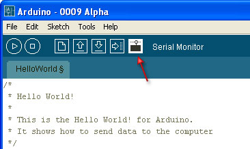

# Lesson 4: Arduino grows up and learns to talk!

## Introduction

Ah, Arduino, I remember when you were just crawling around and blinking LEDs. Now you're ready to learn how to speak! In this lesson we'll learn how to use the **Serial Library** to communicate from the Arduino board back to the computer over the USB port. Then we'll learn how to manipulate numbers and data.

For this lesson we won't be using the shield, so simply remove it \(keeping the mood light LEDs on it you'd like\). The shield doesn't contain any programs or data, it is just our way of connecing up the LEDs and resistors. We'll use the shield again but for now, we can examine the RX and TX LEDs on the main Arduino board which will help you with debugging

## What is a Library?

Libraries are great places, and not yet illegal in the United States! If you ever need to learn how to do something, like say fix a motorcycle, you can go to your local library and take out a book. Sure you could buy the book but the library is nice because as a **resource** you can get the book whenever you need it, keeping your house uncluttered.

**Software Libraries** are very similar. We already studied what a **procedure** is, in [lesson 3](lesson3.md): a procedure is a list of things to do. A library is a big collection of procedures, where all the procedures are related! If you, say, want to control a motor, you may want to find a Motor Control Library: a collection of procedures that have already been written for you that you can use without having to do the dirty work of learning the nuances of motors.

The library we will be using is the Serial Library, which allows the Arduino to send data back to the computer:

## What is Serial?

**Serial** may sound like a tasty breakfast food, but its actually quite different. The word **serial** means "one after the other." For example, a serial killer doesn't stop with one murder, but stabs many people one after the other. Serial data transfer is when we transfer data one **bit** at a time, one right after the other.

Information is passed back & forth between the computer and Arduino by, essentially, setting a pin high or low. Just like we used that technique to turn an LED on and off, we can also send data. One side sets the pin and the other reads it. It's a little like [Morse code](https://en.wikipedia.org/wiki/Morse_code), where you can use _dits_ and _dahs_ to send messages by [telegram.](https://en.wikipedia.org/wiki/Telegram) In this case, instead of a long cable, its only a few feet.

 _This is as good as Microsoft Visio can do, yay!_

\(Now, people who are all geeked-out will probably get angry at this point because I'm simplifying things. Well guess what, its an Arduino tutorial, not a OSI Physical Network Architecture tutorial.\)

## Bits & Bytes

> _The world isn't run by weapons anymore, or energy, or money. It's run by little ones and zeroes, little bits of data. It's all just electrons._

-Sneakers

Now is a good time to review how data is measured. For example, we measure weight with "ounces" and "pounds" \(or grams and kilograms\) and distances with "inches," "feet," and "miles" \(or centimeters, meters and kilometers\). Information has its own system of measurements:

A **single bit** is either a **zero** or a **one**. You can group bits together into **8 bits** which is **1 byte**. 1024 bytes \(8192 bits\) is one **Kilobyte** \(sometimes written KB\). 1024 KB \(1048576 bytes\) is one **Megabyte** \(MB\) 1024 MB is 1 **Gigabyte** \(GB\)

An interesting thing to note is while 1000 grams is a kilogram, nearly all computer systems consider 1024 bytes to be a kilobyte. That is, a 1.0 Kilobyte file on your computer is 1024 bytes:


### Quick quiz!

**If your hard disk is 200 Gigabytes, how many bytes is that? Use a calculator with lots of digits!** _Highlight the text below for the answer_ 200 GB  _1024 = 204800 MB 204800 MB_  1024 = 209715200 KB 209715200 KB \* 1024 = 214748364800 bytes!

**Hard drive makers are quite sneaky, you'll notice that they define GB as being 1000 MB, and 1 MB = 1000 KB, etc. Given this fact, how many bytes can you** _**really**_ **store in your 200GB drive?** _Highlight the text below for the answer_ 200 GB  _1000 = 200000 MB 200000 MB_  1000 = 200000000 KB

**How much less storage do you get thanks to the marketing guy who came up with this trick?** _Highlight the text below for the answer_ About 4.6% less than you'd expect

## A familiar friend?

We've actually used the Serial communications capability already quite a bit...that's how we send sketches to the Arduino! When you **Compile/Verify** what you're really doing is turning the sketch into **binary data** \(ones and zeros\). When you **Upload** it to the Arduino, the bits are shoved out one at a time through the USB cable to the Arduino where they are stored in the main chip.

Next time you upload a sketch, look carefully at the two LEDs near the USB connector, they'll blink when data is being transmitted. One blinks when the Arduino is receiving data **\(RX\)** and one blinks when the Arduino is transmitting data \(**TX**\)


Time for our first sketch

Enough chatting amongst ourselves, its time to get the Arduino talking. Our first sketch is going to be the **hello world!** program. When it starts up, it will say "hello world!"

Create a **New Sketch...** and save it as **HelloWorld**


Into the new sketch, copy and paste the following source code, then save it

```c
/*
 * Hello World!
 *
 * This is the Hello World! for Arduino.
 * It shows how to send data to the computer
 */

void setup()                    // run once, when the sketch starts
{
  Serial.begin(9600);           // set up Serial library at 9600 bps

  Serial.println("Hello world!");  // prints hello with ending line break
}

void loop()                       // run over and over again
{
                                  // do nothing!
}
```

OK first thing to notice is that there's nothing in the `loop` procedure! We've gutted it...and put some stuff into the `setup` procedure.

> Even if we have nothing in the `setup` or `loop` procedures, the Arduino requires them to be there. That way it knows you really mean to do nothing, as opposed to forgetting to include them!

The first line of code in the `setup` procedure is this one:

`Serial.begin(9600); // set up Serial library at 9600 bps`

We definitely see that there is a **Serial** thing going on, and it looks like there is a procedure call as well. This is a **library procedure call**. The library is called **Serial** and inside the library is a procedure called `begin`.

| library name | . | **procedure name** | \(input values\) |
| :---: | :---: | :---: | :---: |
| Serial | . | begin | \(9600\) |

If there's no library name, it means that the procedure is in the 'default' collection of procedures we use. For example, `delay()` is so common, the designers of the Arduino software didn't bother putting it into a library.

So there's some mystery procedure that's called `begin`, well it's not too tough to figure out what it might do. It's the procedure that gets the Serial stuff ready. But what's the **9600** about? The comment says **9600 bps**, and just so you know bps stands for bits-per-second \(we will refer to this as the **baud rate**\) If you have broadband connection, you may remember reading somewhere that it has, say 350 kbps download rate. This is how fast the connection can read and write bits on the wire. \(Needless to say, your broadband connection can transfer data a lot faster than an Arduino!\)

OK so `Serial.begin` sets up the Arduino with the transfer rate we want, in this case 9600 bits per second.

Lets move on to the next line.

`Serial.println("Hello world!"); // prints hello with ending line break`

This line also uses the **Serial** library, this time it's calling a procedure called `println` which is just a shorthand for "print line". Note that the 6th letter in `println` is the letter L not the number 1. This time the input is a quotation, the line of text we would like it to print. We use two **"**'s \(double quotes\) to indicate the beginning and end of a line of text.

### Quick quiz!

* **If the Arduino transfers data at 9600 bits per second and you're sending 12 bytes of data, how long does it take to send over this information?** _Highlight the text below for the answer_

  12 bytes of data equals 12 \* 8 = 96 bits of data. If we can transfer 9600 bits per second, then 96 bits takes 1/100th of a second!

* **If the Arduino transfers data at 19200 bits per second \(19200 baud\) and you're sending 12 bytes of data, how long does it take to send over this information?** _Highlight the text below for the answer_

  This is twice as fast as before, so it will take half the time, about 1/200th of a second.

Good, now compile the sketch and upload it to your Arduino....

## And then...nothing???

It looks like not much is going on here. Somewhat disappointing since we had so much fun with blinking colored lights before. The trick here is that while you can see blinking lights quite easily, seeing serial data requires a **monitor**, which like your display monitor will show us what data is being transfered.

Lucky for us, there's a serial monitor built into the Arduino software!



I'm not quite sure what the icon means, but regardless if you click that button you will replace the black Program Notification area with a Serial Monitor.

So...click it!

Hello...world?

What happens next is, sadly, quite dependent on which kind of Arduino you have

|  | Windows | Mac OS X | Linux |
| :---: | :---: | :---: | :---: |
| NG | Arduino does not reset. | Arduino does not reset. | Arduino does not reset. |
| Diecimila | Arduino resets, starts the sketch a few seconds later | Arduino resets, starts the sketch a few seconds later | Arduino resets, starts the sketch a few seconds later |

In the very common case of having a Diecimila Arduino, the serial monitor will auto-reset the Arduino. The sketch will start up a couple of seconds later

Otherwise, the Arduino does not reset itself. Either way, once you've switched to the serial monitor, press the reset button. If you have an NG Arduino you'll have to wait 7 seconds for the sketch to start.


Voila! It is our sketch!

> **Baud rate match up!**
>
> If you ever find that you're getting a whole lot of gibberish instead of proper text, make sure that you have the correct baud rate selected in the drop down menu of the Serial Monitor. Note that this communication baud rate is indepedent of the upload process, which is fixed at 19200 bps.

Next, try pressing the reset button a few times to make more Hello Worlds! appear. If you have an NG, this may be a bit annoying but do it anyways.


Each time you reset the Arduino, it performs the `setup` procedure, and prints out Hello again. If you look closely at the Arduino, you will also see the little **TX** LED blink just as it prints out this message. That's your indication that data was sent.

> **What's Send do?**
>
> When you `println` you are sending data from the Arduino to the computer. The Send button \(and the text input next to it\) are used to send data **to** the Arduino. We aren't going to be using it in this lesson so don't be surprised that it doesn't do anything when you click it!

```text
10 PRINT HELLO
20 GOTO 10
```

Our next sketch will be a minor modification of this one. Instead of printing out Hello World just once, we'd like it to print it out over and over and over again.

### Quick quiz!

* \*\*What simple modification should we perform to make the Arduino print Hello World over and over again? _Highlight the text below for the answer_

  Simply move the **Serial.println\("Hello world!"\);** statement from the `setup` procedure to the `loop` procedure.

Perform this modification and then compile and upload the new hyper-hello sketch. Then start up the serial monitor. You will see Hello World! scroll by super fast!


### Quick quiz!

* \*\*Whats going on with the TX LED? _Highlight the text below for the answer_

  It's lit, not blinking

* **Try waving the Arduino around in a dark room, what do you see?** _Highlight the text below for the answer_

  There are little dotted light trails

* **What's going on here? Hint: Remember** [**lesson 2**](https://github.com/bmsa-cs/LadyAda-Arduino-Tutorials/tree/0229aba967c64040fd37b249b90f53855c7030bd/lesson2.html)**?** _Highlight the text below for the answer_

  The data is being transmitted so fast, that we can't see the TX LED blinking...it's sending data many times a second!

Make the Arduino chill out a little by adding a one second delay to the sketch, so that it only prints out Hello World once a second.

```c
/*
 * Hello World!
 *
 * This is the Hello World! for Arduino.
 * It shows how to send data to the computer
 */

void setup()                    // run once, when the sketch starts
{
  Serial.begin(9600);           // set up Serial library at 9600 bps
}

void loop()                       // run over and over again
{
  Serial.println("Hello world!");  // prints hello with ending line break delay(1000);
}
```

Now you should spend some time playing with `println` and making it display a message of your choice! Perhaps add some more `println` statements in order to make the message longer?

## Math is hard, let's try programming!

We've played around with printing out phrases, but it turns out we can also print out numbers pretty easily too.

```c
/*
 * Math is fun!
 */

int a = 5;
int b = 10;
int c = 20;

void setup()                    // run once, when the sketch starts
{
  Serial.begin(9600);           // set up Serial library at 9600 bps

  Serial.println("Here is some math: ");

  Serial.print("a = ");
  Serial.println(a);
  Serial.print("b = ");
  Serial.println(b);
  Serial.print("c = ");
  Serial.println(c);

  Serial.print("a + b = ");       // add
  Serial.println(a + b);

  Serial.print("a * c = ");       // multiply
  Serial.println(a * c);

  Serial.print("c / b = ");       // divide
  Serial.println(c / b);

  Serial.print("b - c = ");       // subtract
  Serial.println(b - c);
}

void loop()                     // we need this to be here even though its empty
{
}
```

Try out this sketch on your Arduino


Note that we're using 2 procedures here, the original `println` and now also **print**. The **print** procedure is just like `println` except it does not print out a "carriage return" at the end, starting a new line. You can experiment with changing the **print**'s to `println`'s and looking at the Serial Monitor output to verify this for yourself.

Here's whats going on in the Arduino with this sketch. For example, lets look at this line:

`Serial.println(a);`

We've seen that if you use a quoted line of text as input to `println` procedure, it will display that text. In this case you can see that if you use a variable to `println` it will look up what that variable contains and print that out!

It turns out that the Arduino is smart enough to also do math when asked:

`Serial.println(a + b);`

In this case, the Arduino looks at what the input to `println` is, and finds its actually a calculation. It looks up what `a` is \(5\) and what `b` is \(10\) and then adds them together \(+\) and then uses that as the value to send to `println`

Note that for now, we can only do math using **integers**, which if you recall, are whole numbers. That means we can't yet print out numbers like 3.14 or 1.5.

I could go on and on about operators, its all very important stuff, but many people have written good tutorials on this topic already so I'm going to send you off to read them there!

* [A C++ tutorial](https://www.cplusplus.com/doc/tutorial/operators.html) \(this one's pretty nice, just ignore the **cout** stuff which is C++'s way of printing out values\)
* [A C tutorial on operators](https://www.exforsys.com/tutorials/c-language/c-operators.html)
* [A list of all the math operators](https://computer-programming-tutorials.suite101.com/article.cfm/introduction_to_operators_in_cc)

## Pythagorean party


Let's make our first simple calculator, to calculate a **hypoteneuse**. If you remember from grade school, if you have a right-triangle, the hypoteneuse `h` can be calculated from the lengths of the two legs, c1 and c2 \(which we'll call `a` & `b`\)

a^2 + b^2 = h^2

h = √\(a^2 + b^2\)

```c
/*
 * Math is fun!
 */

#include "math.h"               // include the Math Library

int a = 3;
int b = 4;
int h;

void setup()                    // run once, when the sketch starts
{
  Serial.begin(9600);           // set up Serial library at 9600 bps

  Serial.println("Lets calculate a hypoteneuse");

  Serial.print("a = ");
  Serial.println(a);

  Serial.print("b = ");
  Serial.println(b);

  h = sqrt( a*a + b*b );

  Serial.print("h = ");
  Serial.println(h);
}

void loop()                // we need this to be here even though its empty
{
}
```

The first thing that's new here is this line at the very beginning of the sketch:

`#include "math.h" // include the Math Library header`

Which basically says "We'd like to use the math procedures, which are in a library that requires us to include the file math.h where the `sqrt` procedure lives". Just ignore it for now, it's not important.

The second thing that's different here is that when we create the variable `h` we don't assign it a value.

`int h;`

It turns out that this is totally OK, it just means that we don't know what `h` is going to store yet, because we're going to calculate it later. Since it's not assigned to a value upon creation, the Arduino just creates the box, the stuff inside is whatever was in left over in memory.

> **Default values**
>
> If you don't assign a value to a variable, it could be any value. Make sure you don't try to use the variable before you assign it a value!

Later on in the sketch, we assign it the value.

`h = sqrt( a*a + b*b );`

In this line, we square `a` and `b` and then add them together, then we call the `sqrt()` procedure \(which does exactly what you may think\), to take the square root. Then we assign that to the variable `h`.

| Variable | = | **Value** | **;** |
| :--- | :--- | :--- | :--- |


Whatever was in `h` before is lost, replaced by the new value.

You can nest procedures and functions all you want, calling a procedure on the return value of another procedure.

### Quick quiz!

* **Lets say you have a variable "foo" which contains a number. You'd like to find the square root of the square root of this number. What line of code would print out this value?** _Highlight the text below for the answer_

   `Serial.println( sqrt( sqrt(foo) );`

  First take the square root of **foo**, then take the square root of that and then use that value as the input to `println` &lt;/span&gt;

**Now its your turn to create a calculator**. You'll create a **Ohm's law** calculator. Ohm's law says that **Voltage = Current \* Resistance**. \(This is a pretty useful law which forms the basis of electronics, and we'll study it in depth more later.\) Starting with two variables, **i** for current and **r** for resistance, have it print out the amount of voltage that can be measured accross the resistor.

## Drive size calculator

Let's write a program that will do that hard drive size calculation we did before. We'll start with the hard drive size in GB, and print out how many MB there are.

We'll start simple, just printing out the drive size in GB

```c
/*
 * Drive size calculator!
 */

int drive_gb = 5;

void setup()                    // run once, when the sketch starts
{
  Serial.begin(9600);           // set up Serial library at 9600 bps

  Serial.print("Your HD is ");
  Serial.print(drive_gb);
  Serial.println(" GB large.");
}

void loop()               // we need this to be here even though its empty
{

}
```

Copy and paste this sketch into Arduino software and name the sketch `DriveCalc`. Then compile and upload it.


OK, lets add a section of code that will print out the number of Megabytes in the hard drive.

```c
/*
 * Drive size calculator!
 */

int drive_gb = 5;
int drive_mb;
void setup()                    // run once, when the sketch starts
{
  Serial.begin(9600);           // set up Serial library at 9600 bps

  Serial.print("Your HD is ");
  Serial.print(drive_gb);
  Serial.println(" GB large.");

  drive_mb = 1024 * drive_gb;

  Serial.print("It can store ");
  Serial.print(drive_mb);
  Serial.println(" Megabytes!");
}

void loop()                 // we need this to be here even though its empty
{

}
```

This time if you compile and upload it you should get


Which is correct, yay! Now try a few different whole numbers for the drive size, from 1 GB to 100 GB.

You may notice that if you put in a 100GB drive size, something very, very strange happens:


A 100GB drive should have 102400MB in it, not some negative number. What's going on here?

## Introduction to types \(part 1\)

What's happening is that we have an **overflow** problem. Think about your car odometer. The odometer has only 4 digits, it can display 0 miles to 9999 miles travelled. If you travel 10000 miles, the odometer will "roll over" to 0 again, and from then on it will display an incorrect value.

Keeping that in mind, remember in [lesson 2](lesson2.md) we said that when we define a variable we also define the **box-type** of the variable? The box is where we store the data, in this case the **type** is **int**. It turns out that an **int** type can store only 2 bytes.

### Quick quiz!

**How many bits are in 2 bytes?**

_Highlight the text below for the answer_  There are 8 bits in 1 byte so 2 bytes is 16 bits

To figure out how big a number we can store in a 2 byte-sized box use a calculator and take 2 to the power of the number of bits \(since each bit can store 2 values, 0 or 1\). Then we subtract 1 because like in the car odometer, you can't actually display the final value, 10000. So, in this case the largest number is 2^16 - 1 = 65535. Since the number we're trying to store \(102400\) is larger than that, we see that "rollover."

OK let's fix it! All we need to do is change the variable type so that it can store more than 2 bytes of data. Here is a short list of types we can use.

| Type | Size \(bits\) | Size \(bytes\) |
| :---: | :---: | :---: |
| byte | 8 | 1 |
| int | 16 | 2 |
| long | 32 | 4 |

It looks like we want to use the `long` type. So lets make that change

```c
/*
 * Drive size calculator!
 */

int drive_gb = 100;
long drive_mb; // we changed the type from "int" to "long"
 void setup()                    // run once, when the sketch starts
{
  Serial.begin(9600);           // set up Serial library at 9600 bps

  Serial.print("Your HD is ");
  Serial.print(drive_gb);
  Serial.println(" GB large.");

  drive_mb = 1024 * drive_gb;

  Serial.print("It can store ");
  Serial.print(drive_mb);
  Serial.println(" Megabytes!");
}

void loop()                // we need this to be here even though its empty
{

}
```

Compile and upload this sketch....then run the Serial Monitor....


Uh oh, we didn't actually fix the problem!

How frustrating, we did the right thing and it still didn't work. The problem we have now is although the boxes are the right size, we're not handling them well.

`drive_mb = 1024 * drive_gb;`

If you look at this line, what's happening here is that the Arduino looks up the value of the variable `drive_gb` to get 100. Then we multiply 100 by 1024 to get 102400 and put that in the `drive_mb` box. Except the way that the Arduino software does this is that it creates a temporary variable the same size as `drive_gb` to store that calculation result before it sticks it into `drive_mb`. So basically we are still getting an overflow, except now its happening as we do the calculation.

Here is one way to fix this insiduous bug:

```c
/*
 * Drive size calculator!
 */

int drive_gb = 100;
long drive_mb;
 void setup()                    // run once, when the sketch starts
{
  Serial.begin(9600);           // set up Serial library at 9600 bps

  Serial.print("Your HD is ");
  Serial.print(drive_gb);
  Serial.println(" GB large.");

  drive_mb = drive_gb;
  drive_mb = drive_mb * 1024;

  Serial.print("It can store ");
  Serial.print(drive_mb);
  Serial.println(" Megabytes!");
}

void loop()            // we need this to be here even though its empty
{

}
```

Now when we do the calculation, the temporary result is stored in a box the same size as `drive_mb` \(a `long`\) instead of an `int`.

Compile and upload this sketch to try it out


There you go, now its working!

## Introduction to types, part 2

It turns out that I wasn't completely honest in the previous section when I described all the different types. There's another important fact to know, and that has to do with storing negative numbers.

We know that a variable that is 2 bytes large \(16 bits\) can store 216 different values. We assumed before that these values were 0 - 65535 inclusive. But then how do we store negative numbers? It turns out that there are two kinds of variables, `signed` and `unsigned`. **Signed** variables can have a positive or negative value, so you can store negative numbers. **Unsigned** variables can _only_ store positive numbers.

By default, variables are signed.

| Type | Size \(bits\) | Size \(bytes\) | Minimum Value | Maximum Value |
| :--- | :--- | :--- | :--- | :--- |
| `unsigned byte` | 8 | 1 | 0 | 255 |
| `byte` | 8 | 1 | -128 | 127 |
| `unsigned int` | 16 | 2 | 0 | 65535 |
| `int` | 16 | 2 | -32768 | 32767 |
| `unsigned long` | 32 | 4 | 0 | 4294967295 |
| `long` | 32 | 4 | -2147483648 | 2147483647 |

### Quick quiz!

* **Lets say you have a program that stores the age of a human in years \(which so far is no more than 122\), whats a good data type to use?** _Highlight the text below for the answer_

  You probably want to use a `byte` type

* **Lets say you want to store the age of a human in seconds, what is an appropriate data type now?** _Highlight the text below for the answer_

   110 years = 3468960000 seconds. You'll need to store this in an `unsigned long` variable.

> **Why Types?**
>
> OK so you're probably wondering: "This is such a pain, why bother with different size types? Lets just have every variable be as big as possible and we'll never have roll-over problems."
>
> Well, on your desktop computer, with gigabytes of memory \(RAM\), this is a reasonable thing to do. However, the tiny tiny computer in the Arduino has a grand total of 1 Kilobyte of memory. And some of that is used for background stuff you don't see. For small sketches sure you can make everything a **long** and be done with it, but if you have a bigger sketch, you'll run out of memory really fast and then you'll have major problems. So in this case, every byte counts!

What's weird about signed numbers is that if you reach the end of the positive value range you'll rollver into the negative values.

For example, lets say you have a `signed int`. If you have the value 32767 in that variable, and you add 1 to the variable, you'll actually rollover to -32768.


This sketch will test out this fact:

```c
int test = 32767;
 void setup()                    // run once, when the sketch starts
{
  Serial.begin(9600);           // set up Serial library at 9600 bps

  Serial.print("Test value is: ");
  Serial.println(test);

  test = test + 1;

  Serial.print("Now it is ");
  Serial.println(test);
}

void loop()            // we need this to be here even though its empty
{

}
```

Compile and upload to run the test.


### Quick quiz!

* **Let's say we have a variable that is byte type, it's signed by default. It starts out with the value 127 and we add one to the variable, what will the new variable value be?** _Highlight the text below for the answer_

   It's a signed variable so it will roll over to -128

* **Let's say now it is an unsigned byte type, what happens now?** _Highlight the text below for the answer_

  Since it is unsigned, it can store much more data, so it will be able to hold the value 128.

* **If we have an unsigned byte and it starts out with the value 250 and we add 10, what will the value be?** _Highlight the text below for the answer_

  Even though thie variable can store a lot, it can't store more than the number 255, so it will rollover and we'll end up with the number 4.

Now it's your turn!

**Write some sketches that will help you understand variable sizes, try creating variables of different types and signedness and adding and subtracting.**

Although this lesson part seems quite boring, and severely lacking in blinky lights, understanding this stuff now will save you from a lot of headaches later when you have data overflows and your program is all wonky and you're really frustrated because you can't figure out why. \(Trust me on this one!\)

## Wrapping up, the final project!

Now its time for you to expand the drive size calculator. Starting with the `DriveCalc` sketch, modify it so that it will also calculate how many KB are stored in the hard drive. Test it out with a couple different drive sizes.

Once you've got that working, modify it again so that it will also display how much space the drive actually holds thanks to the sneaky math-trick that manufacturers use. Have the sketch display how much storage space is 'missing' \(in KB\) as well.

Here's one possible solution: 

```c
/*
 * Drive size calculator!
 */

int drive_gb = 100;
long drive_mb;
long drive_kb;
long real_drive_mb;
long real_drive_kb;

void setup()                    // run once, when the sketch starts
{
  Serial.begin(9600);           // set up Serial library at 9600 bps

  Serial.print("Your HD is ");
  Serial.print(drive_gb);
  Serial.println(" GB large.");

  drive_mb = drive_gb;
  drive_mb = drive_mb * 1024;
  drive_kb = drive_mb * 1024;

  Serial.print("In theory, it can store ");
  Serial.print(drive_mb);
  Serial.print(" Megabytes, ");
  Serial.print(drive_kb);
  Serial.println(" Kilobytes.");

  real_drive_mb = drive_gb;
  real_drive_mb = real_drive_mb * 1000;
  real_drive_kb = real_drive_mb * 1000;

  Serial.print("But it really only stores ");
  Serial.print(real_drive_mb);
  Serial.print(" Megabytes, ");
  Serial.print(real_drive_kb);
  Serial.println(" Kilobytes.");

  Serial.print("You are missing ");
  Serial.print(drive_kb - real_drive_kb);
  Serial.println(" Kilobytes!");
}

void loop()                       // run over and over again
{
}
```

## Conclusion

Good work, you got through one of the more boring lessons. In this lesson you learned how to print text and data to the Serial Monitor. This is essential for debugging future projects! You also learned about data types and storage and how to use the Arduino to calculate stuff.

