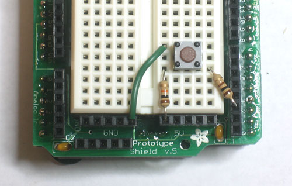

# Lesson 5: Sensors

## Introduction

We've done a lot so far, blinking lights, printing messages...all of that stuff is `OUTPUT`: signals coming from the Arduino. The next step is to start playing with `INPUT`, with the Arduino responding to outside events. In this lesson we will begin with the most basic kind of input, a push-button switch!

What you'll need:

* Assembled Arduino board, preferrably a Diecimila (or whatever the latest version is) but NG is OK too
  * [Adafruit](http://www.adafruit.com/index.php?main_page=product_info&cPath=17&products_id=50)
* USB Cable. Standard A-B cable is required. Any length is OK.
* 5 Red LEDs
* 6mm tact switch (pushbutton)
* One 100 Ω Resistor (brown black brown gold)
  * Any values from 20 Ω to 220 Ω is probably OK.
* Five 1KΩ Resistors (brown black red gold)
  * Any values from 300 Ω to 2KΩ are probably OK.
* One 10KΩ Resistors (brown black orange gold)
  * Any value from 5KΩ to 100KΩ is probably OK.
* Arduino Prototyping Shield with tiny breadboard  
* Hookup Wire
* Get 22 gauge solid-core wire in red, black and some other color. Make sure its _not_ stranded wire!

## What's a switch?

You're probably familiar with switches, there's tons of them in your house. One kind of switch you use every day is a light switch. A light switch is a simple device with two positions, on and off. When on, two wires are connected inside, which allows current to flow. When off, the two wires are disconnected.


On the left, the switch is **open** and no current flows. On the right, the switch is **closed**, current flows and the light turns on.

  
(thanks wikipedia!)

In this photo, you can see the internals of a light switch. The two wires connect to the top and bottom. The flat bar that goes verically down the middle is what is physically moved to connect or disconnect.

Light switches are great but we need something smaller. We'll be primarily using 6mm tactile button switches.


These little switches are a 1/4" on each side, cost about 25 cents, and can plug directly into a breadboard. These mechanical devices have 4 legs, which may make you think that there are 4 wires that are switched on and off, but in fact, two on each side are actually connected together inside. So really, this switch is just a 2-wire switch.


Normally, the two wires are disconnected (**normally open)** but when you press the little button on top, they are mechanically connected.


To get the buttons to sit better in the protoshield, you may want to straighten out the legs (just squish them with a pair of pliers) so that they look like the button on the left.

### Quick Quiz!

* **Find 5 things around the house that have switches. Whats the average number of switches per device?**

## Light Switch

We're going to make our first test of the pushbutton by having it turn on and off an LED light

  
_Fig 5.1 You'll note that the schematic symbol for a pushbutton switch is a little bit different than the one above_

Get out your red LED and 1.0KΩ resistor, as well as the tiny pushbutton and build the schematic onto your protoshield:

[](images/buttonwired1.jpg)  
[](images/buttonlegsright.jpg)

Power up the Arduino and try pressing the button. The LED should light up when the button is held down (current is able to flow) and go dark when it's released (current is not able to flow).

[](images/buttonpress1.jpg)

    Switch capability

    Before you try to turn a 100W lightbulb on and off using a pushbutton switch, be aware that switches have **ratings** that will tell you the maximum amount of current and voltage they can switch. The little switches are only rated for a few volts and milliAmps. Big switches such as wall light switches are rated for 120V and many Amperes. Make sure you choose the right switch for the job or you may accidentally cause a small fire!

### Quick Quiz!

* **What does this wiring setup do? (The LED is connected to ground, but its kind of hidden in this photo) Make a guess and then build it and test your guess.**
    [](images/miswire.jpg)  
* The switch is oriented so that the LED is always on!

These switches have the part number **B3F-1000**, [here is a datasheet webpage for the part](http://www.adafruit.com/datasheets/B3F-1000-Omron.pdf). There's a lot of information, but learning how to navigate these sorts of pages is rather important. Use your detective skills to figure out the follwing:

* **What is the maxiumum amount of current this button can switch?**  
  * 50 mA
* **What is the maximum voltage you can use this switch for?**  
  * 24V
* **What is the recommended Operating Force (how hard the button is pressed) for the B3F-1000?**  
  * 0.98 Newtons (100 gf)

## DigitalRead

Switches are great for controlling current, as shown by our little light switch demo. But they're even better as input devices!

In previous lessons we set a pin on the microcontroller (say **pin 13**) to `HIGH` (5V) or `LOW` (ground, 0V) using the **DigitalWrite** procedure. Now we get to do the opposite. We will set the voltage on a pin to 5V or ground and then use `DigitalRead` to inquire whether that pin is `HIGH` or `LOW`

For our first test, we will use a wire as our switch. Turn on the Arduino and run this little sketch

```c
  /*  
  * Switch test program  
  */
  int switchPin = 2;              // Switch connected to digital pin 2

  void setup()                    // run once, when the sketch starts
  {
    Serial.begin(9600);           // set up Serial library at 9600 bps
    pinMode(switchPin, INPUT);    // sets the digital pin as input to read switch
  }

  void loop()                     // run over and over again
  {
    Serial.print("Read switch input: ");  
    Serial.println(digitalRead(switchPin));    // Read the pin and display the value  
    delay(100);
  }
```

You'll note that we have to tell the Arduino to set the pin as an input. This is pretty easy, use `pinMode()` but use `INPUT` instead of `OUTPUT`

`pinMode(switchPin, INPUT);    // sets the digital pin as input to read switch`

We also use the new `digitalRead()` procedure, which just takes as an input the pin to examine.

`Serial.println(digitalRead(switchPin));    // Read the pin and display the value`

The `digitalRead()` procedure **returns a result** when its done. That result is either 0 (`LOW`) or 1 (`HIGH`) depending on what it saw when it looked at the pin's voltage. In this case, we read the pin and then **pass the result** as an input to _another_ procedure, `println()`. Sure we could use a variable to hold the result from `digitalRead()` and then use that variable as input to `println()` but this is much more succinct.

```c
var = digitalRead(switchPin);      // read the pin and save it into var
Serial.println(var);               // print out the value stored in var
```

Now use a wire to alternate between connecting **Pin 2** to 5V and Ground through a 100Ω resistor, and watch the serial monitor.

  
_Fig 5.2_

_[](images/tiehigh.jpg)  
Switch input tied `HIGH` (5v)_

_  
[](images/tielow.jpg)  
Switch input tied LOW (ground)_

You should see it print out two messages depending on whether a the wire jumper connects the input to `HIGH` (5V) or LOW (ground) voltage. Dont forget, in digital binary land, `HIGH` is another word for 1 and LOW is another word for 0\.


    Valid inputs

    The best way to completely destroy a microcontroller such as an Arduino is to feed it voltages that are much too high. Make sure your input voltages are between 0 and 5V! **Never connect a 9V battery directly into an input pin, it will fry the pin for good and possibly destroy the Arduino microcontroller!**


    Whats this 100Ω resistor all about? 

    There's a 100Ω resistor we use to connect the input pin to either `HIGH` or LOW voltage. Why is it there? Well, lets say you accidentally set `P2` to be an `OUTPUT` type pin, but then you connected it to 5V. If you write a LOW to the pin (0V) but its connected to `HIGH` (5V), you've basically caused a short circuit at that pin. This isn't very good for the pin and could damage it! The 100Ω resistor acts as a buffer, to protect the pin from short circuits.

## Floating high above the clouds

Of course, connecting and disconnecting a wire is a lot of work, and we'd like to replace that with a mechanical switch. Only thing is, our switch can only connect and disconnect two wires, it can't alternate connections.


_Fig 5.3 Our two alternative switch wiring possibilities_

For example, in these schematics we can connect and disconnect **pin 2** to 5V, or we can connect and disconnect **pin 2** to ground. In both cases, as long as the button is held down, the pin is connected to a **valid input** voltage. When the button is released, though, **pin 2** is not connected to _anything_. This is called a **floating input** voltage. Basically, it's invalid input!

Try building up one of these schematics, and trying out the switch testing sketch above. When the button is held down you should definately get the right printout. When its released, it may keep the old value, or it may change, but its certainly not reliable!

[](images/testswitchnopulldown.jpg)  
_Wiring when the switch is connected to 5V_

[](images/testswitchnopullup.jpg)  
_Wiring when switch is connected to ground_

One solution is to get a switch that alternates connections, like this one, diagrammed here.

  
_Fig 5.4_

The problem is, these switches are suprisingly complex and 10 times more expensive than a little tactile button! Instead we use a trick called a **pull-down** resistor.

  
_Fig 5.5_

The pull-down resistor here is the 10K resistor. When the switch is held down, the 100Ω resistor is connected directly to 5V. When the switch is released, the 100Ω resistor is connected to the 10K resistor which **pulls it down** to ground.

Here's how to think of it: When you press the button and connect the 100Ω resistor to 5V, the button has a very small resistance (less than 1 Ω!), so it provides a **strong** pull to 5V.  
The 10KΩ resistor is also connecting the 100Ω resistor to ground, but since the 10KΩ resistor has 10000 times more resistance than the button, its a very **weak** pull to ground and can't compete. The strong 5V connection overpowers the weak ground connection and the input pin reads `HIGH`.

However, when the switch is disconnected, there is no longer a strong pull to 5V. In fact, its let go completely. But there is still weak pull to ground. Despite being a weak connection, it's better than nothing and so the resistor pulls the input pin to `LOW`.

Build this circuit and try it out with the switch test sketch. It should be very reliable now! If its not working, make sure you have the right resistor values and that the parts are connected up properly.

[](images/testswitchpulldown.jpg)

You can also use the switch to connect the input to ground, and use a resistor as a **pull-up** resistor.

  
_Fig 5.6_

Try this schematic as well, and verify for yourself that the button is now reliable.

Note that the strong and weak connections have nothing to do with whether the switch is configured as a pull-up or pull down. The strength of the connection comes from the fact that the button is very low resistance when held down and that the resistor is much much more resistive to current flow than the button.

[](images/testswitchpullup.jpg)

    Must a pullup/down resistor be 10KΩ?

    You'll notice that both the Arduino schematic, and the examples here use a 10KΩ resistor as the pullup or pulldown. Is there something special about 10KΩ? Nope! While, it is pretty much univerally used as the 'default' value, most of the time you can use as high as 100KΩ or as low as 4.7KΩ. Going much lower will waste more power, going higher may give you unstable results (due to microcontroller-internals that are not that important right now).  
    I suggest going with 10KΩ because they are common resistor values and people reading your schematic will be more likely to understand that its 'just a pullup resistor'.

### Quick Quiz!

* **With the pull-down resistor configuration, what is the value read by digitalRead() when the button is pressed?**  
  * The returned value is 1 (`HIGH`)
* **With the pull-down resistor configuration, what is the value read by digitalRead() when the button is released?**  
  * The returned value is 0 (LOW)
* **With the pull-up resistor configuration, what is the value read by digitalRead() when the button is pressed?**  
  * The returned value is 0 (LOW)
* **With the pull-up resistor configuration, what is the value read by digitalRead() when the button is released?**  
  * The returned value is 1 (`HIGH`)
* **Lets say you wanted to design a switch so that when its pressed, the value read from the pin is 1, and when it's released the value is 0\. Would you use a pull-up or pull-down resistor configuration?**  
  * You would want to use a pull-down resistor configuration.

Here is a small part of the Arduino schematic, [(you can see the whole thing here)](http://www.arduino.cc/en/uploads/Main/Arduino-Diecimila-schematic.pdf)

[](http://www.arduino.cc/en/uploads/Main/Arduino-Diecimila-schematic.pdf)  
_Fig 5.7_

There is a switch and a resistor (Europeans use a rectangle instead of a squiggly for resistors), they are both connected to a pin on the Arduino microcontroller called RESET (in the bottom right corner)

* **Is this switch connected up with a pull-up or pull-down resistor? What value is the resistor?**  
  * The resistor is a 10KΩ pull-up
* **The switch is called S1, look on your Arduino (you may have to remove the shield to see it) to identify S1\. What is S1 used for?**  
  * S1 is the button you press to reset the Arduino
* **Based on what S1 does and what you've learned about pullup/pulldown resistors, describe what you think this circuitry does, and how the RESET pin works**  
  * Normally the RESET pin is pulled up to 5V. When the button is pressed, the pin is connected to ground. The Arduino microntroller resets itself when the RESET pin is connected to ground.

## Iffy statements

The next step is to combine inputs (buttons) and outputs (LEDs). We will make a simple digitally-controlled light. The sketch we want to write does the following

**When the button is pressed, the LED turns on**

Which we can rephrase more specifically as

**_If_ the button is pressed, turn on the LED.**

**_If_ the button is not pressed, turn off the LED.**

Here is how we will wire up the switch and LED.

  
Fig 5.8

Build this schematic on your protoshield

[](images/digiledswitch.jpg)

Copy and paste this sketch into the Arduino software and upload it to the Arduino. Verify that when the button is pressed, the LED turns on and when the button is released, the LED turns off.  
If its not working, try using **println** statements to debug your project: when you press the button have it print out a message. That way you can tell if its the input half that isnt working or the output half.

```c
/*
 *  Switch and LED test program
 */
 
int ledPin = 12;                // LED is connected to pin 12
int switchPin = 2;              // switch is connected to pin 2
int val;                        // variable for reading the pin status

void setup() {
  pinMode(ledPin, OUTPUT);      // Set the LED pin as output
  pinMode(switchPin, INPUT);    // Set the switch pin as input
}

void loop(){
  val = digitalRead(switchPin);   // read input value and store it in val
  if (val == LOW) {               // check if the button is pressed
    digitalWrite(ledPin, `HIGH`);   // turn LED on
  }
  if (val == `HIGH`) {              // check if the button is not pressed
    digitalWrite(ledPin, LOW);    // turn LED off
  }
}
```

This sketch introduces a completely new and exciting type of statement, the **if statement**. This is a **logical** statement, which you may remember from grade school math class. Basically, until now we've had the Arduino just do stuff: blink LEDs, print out messages, etc. But now we want it to make decisions.

|  if  | (test statement) | {statements to perform if test is True}  |
|:---: |         :--:     |           :--:                           |
|if    | ( val == LOW )   |   { digitalWrite(ledPin, `HIGH`); }      |

The **if** statement is the first statement that is **conditional**, it only runs the statements if a condition is true. In this case, the conditions are "is the button pressed?" and "is the button not pressed?"

### Some Conditional Tests

#### == Equality test

```c
if (foo == 5) {  
    Serial.print("Foo is equal to 5");  
}
```

Make sure you don't confuse this for the **assignment operator =**.

#### `!=` Inequality test

```c
if (digitalRead(buttonPin) != LOW) {  
  Serial.print("The button pin is not LOW ");  
}
```

#### `>` Greater-than test

```c
if ( var2 10 ) {  
  Serial.print("Variable #2 is larger than 10");  
}
```

#### `<` Smaller-than test
```c
if ( chickenstock < 10 ) {
  Serial.print("We have less than 10 chickens in stock");
}
```

#### `<=` Smaller-than-or-equal-to test

```c
if ( 20 <= yearstolive ) {
  Serial.print("Good news, you have at least 20 years left!");
}
```

#### `>=` Greater-than-or-equal-to test

```c
if ( kitten() >= 6 ) {
  Serial.print("The kitten() procedure returned a number larger than or equal to 6");
}
```

### Quick Quiz!

Modify the sketch so that it does the opposite, when the button is pressed the LED turns off and when it is released it turns on. Remember to change the sketch only, use the same circuitry!

Swap the lines `digitalWrite(ledPin, HIGH);` and `digitalWrite(ledPin, LOW);`

Modify the sketch so that the LED blinks 5 times a second (100ms on and 100ms off) when the button is pressed and is completely off when the button is released.

Sample Solution:

```c
int ledPin = 12;                // LED is connected to pin 12
int switchPin = 2;              // switch is connected to pin 2
int val;                    // variable for reading the pin status


void setup() {
  pinMode(ledPin, OUTPUT);      // Set the LED pin as output
  pinMode(switchPin, INPUT);    // Set the switch pin as input
}
void loop(){
  val = digitalRead(switchPin);   // read input value and store it in val
  if (val == LOW) {               // check if the button is pressed
    digitalWrite(ledPin, HIGH);   // turn LED on
    delay(100);
    digitalWrite(ledPin, LOW);   // turn LED on
    delay(100);
  }
}
```

**Note that you don't need to do anything if the `switchPin` is `HIGH` because at the end of the `val == LOW` statements the LED has been turned off!**

 ```c
/*
 *  Switch and 2 LED test program
 */

int led1Pin = 12;               // LED #1 is connected to pin 12
int led2Pin = 11;               // LED #2 is connected to pin 11
int switchPin = 2;              // switch is connected to pin 2
int val;                        // variable for reading the pin status

void setup() {
  pinMode(led1Pin, OUTPUT);     // Set the LED #1 pin as output
  pinMode(led2Pin, OUTPUT);     // Set the LED #2 pin as output
  pinMode(switchPin, INPUT);    // Set the switch pin as input
}

void loop(){
  val = digitalRead(switchPin);    // read input value and store it in val
  if (val == LOW) {                // check if the button is pressed
    digitalWrite(led1Pin, `HIGH`);   // turn LED #1 on
    digitalWrite(led2Pin, LOW);    // turn LED #2 off
  }
  if (val == `HIGH`) {               // check if the button is not pressed
    digitalWrite(led1Pin, LOW);    // turn LED #1 off
    digitalWrite(led2Pin, `HIGH`);   // turn LED #2 on
  }
}
```

Now its your turn: add another red LED and resistor to pin 11, modify the sketch so that when the button is pressed one LED is lit and the other one is off and when the button is released the first LED is off and the second LED is lit.


Try to wire up the protoshield just from the schematic. If you're having trouble, [click here for a photo of the parts wired up.](http://www.ladyada.net/images/arduino/2ledswitch.jpg)

Here is one possible solution sketch:
```c
/*
 *  Switch and 2 LED test program
 */

int led1Pin = 12;               // LED #1 is connected to pin 12
int led2Pin = 11;               // LED #2 is connected to pin 11
int switchPin = 2;              // switch is connected to pin 2
int val;                        // variable for reading the pin status


void setup() {
  pinMode(led1Pin, OUTPUT);     // Set the LED #1 pin as output
  pinMode(led2Pin, OUTPUT);     // Set the LED #2 pin as output
  pinMode(switchPin, INPUT);    // Set the switch pin as input
}


void loop(){
  val = digitalRead(switchPin);    // read input value and store it in val
  if (val == LOW) {                // check if the button is pressed
    digitalWrite(led1Pin, HIGH);   // turn LED #1 on
    digitalWrite(led2Pin, LOW);    // turn LED #2 off
  }
  if (val == HIGH) {               // check if the button is not pressed
    digitalWrite(led1Pin, LOW);    // turn LED #1 off
    digitalWrite(led2Pin, HIGH);   // turn LED #2 on
  }
}
```

## Do it...or else!

Having an LED turn on or off when a button is pressed is quite impressive, but it would be pretty odd if you had to press a button constantly to keep the TV on. What we want is an **alternating action switch**, where the press-and-release of a button does something, not just press-and-hold. Basically we want to test whether the button was _just_ released, or _just_ pressed.

To do this, we need to keep track of the button input value, to see if its changed. This is called the **state** of a button. When [the state](http://en.wikipedia.org/wiki/State_%28computer_science%29) changes (an action occurs), _that's_ when we want to perform an action.

```c
/*  
 *  Alternating switch  
 */
  
int switchPin = 2;              // switch is connected to pin 2
int val;                        // variable for reading the pin status
int buttonState;                // variable to hold the last button state

void setup() {
  pinMode(switchPin, INPUT);    // Set the switch pin as input

  Serial.begin(9600);           // Set up serial communication at 9600bps  
  buttonState = digitalRead(switchPin);   // read the initial state
}

void loop(){
  val = digitalRead(switchPin);      // read input value and store it in val

  if (val != buttonState) {          // the button state has changed!
    if (val == LOW) {                // check if the button is pressed
      Serial.println("Button just pressed");
    } else {                         // the button is -not- pressed...
      Serial.println("Button just released");
    }
  }

  buttonState = val;                 // save the new state in our variable
}
```

Upload it to your Arduino and try it out, watching the serial monitor as you press and release the button.

Lets go through the new lines of code:

`int buttonState;                // variable to hold the button state`

This line isn't too unusual, its just a variable that is going to hold the **state** of the button. Since we don't know the state of the button when the Arduino is first turned on, we will leave it as unknown (**uninitialized**).

  `buttonState = digitalRead(switchPin);   // read the initial state`

In the **setup()** procedure, we **initialize** (set the initial/starting value) of the button state variable by reading the button value once we've started up and set the pin to an input.

```c
void loop(){
  val = digitalRead(switchPin);      // read input value and store it in val
```

OK now to the interesting part. In the **loop** procedure, we begin by first checking the button pin state and storing it an temporary variable **val**.

```c
if (val != buttonState) {          // the button state has changed!
    if (val == LOW) {                // check if the button is pressed
```

Now we see 2 **if** statements that are **nested**, this means that we perform one test and if that test comes out true we go on to perform another test. This is more complex than a simple **if** statement but not much more different than the kinds of decisions we make all the time.

For example:

```c
if ( it is raining ) {                // look up, is there water falling on me?
    if ( I have an umbrella ) {         // check my purse
        OpenUmbrella(); // Perform the umbrella opening procedure
    }
}
```

Of course, we can't open the umbrella if we don't have one. And there's no point in checking if we have one if its not raining!

In the first **if** statement, we check if the current button state (`HIGH` or LOW) is different than the last time we looked at the button. If it is different (tested by the != inequality operator ) then we execute the next group of statements, enclosed by the {} braces.

Lets move on and examine the new statement we see, which is the exotic **if-else** statment.

```c
if (val == LOW) {                // check if the button is pressed
    Serial.println("Button just pressed");
} else {                         // the button is -not- pressed...
    Serial.println("Button just released");
}
```

This statement is easy to understand: before, we would run a test and **if** that test passed, we would perform the statements in the {} braces. Now we also have an **alternative**, which is what we should do if the test fails! Now we used to perform two tests, one for **(val == LOW)** and one for **(val == `HIGH`)**. This code is equivalent but its a little more straightforward. If its not LOW it must be `HIGH`.

|**if** |(test statement) | **{ statements to perform if test is True}** |else | **{ statements to perform if test is not True}** |
|-|-|-|-|-|
| `if` | `( val == LOW )` | `{ ... }` | `else` | `{ ... }`

In the **if-else** statement, we simply examine **val** to deterimine if the last `digitalRead()` procedure informed us that the button is currently pressed or not pressed.

`buttonState = val;                 // save the new state in our variable`

Finally, we make sure that we've updated the button state variable with the current state.

### Quick Quiz!

* **Remove (or comment out) the line that says "buttonState = val;" from the sketch and re-upload it to the Arduino.   What happens now?  
  * When the button is held down, the Arduino prints out "Button just pressed" over and over again. When its released, nothing is printed
* **Why does this happen? Go through the sketch, keeping track of what buttonState and val are storing at each line.**  
  * When the Arduino starts up, it sets buttonState to LOW (assuming the button isn't pressed as it is reset). Whenever the button pin is read as `HIGH` the (val != buttonState) test is true and it prints out a message. The buttonState is never set to `HIGH` so it never prints "Button is released" and it always passes the (val != buttonState) test

## Counting presses

A pretty useful techinque you'll want to add to your collection of sketch-knowledge is how to keep track of button presses. Try this sketch

```c
/*  
 *  Counting presses  
 */
  
int switchPin = 2;              // switch is connected to pin 2
int val;                        // variable for reading the pin status
int buttonState;                // variable to hold the button state
int buttonPresses = 0;          // how many times the button has been pressed 
void setup() {
  pinMode(switchPin, INPUT);    // Set the switch pin as input

  Serial.begin(9600);           // Set up serial communication at 9600bps  
  buttonState = digitalRead(switchPin);   // read the initial state
}

void loop(){
  val = digitalRead(switchPin);      // read input value and store it in val

  if (val != buttonState) {          // the button state has changed!
    if (val == LOW) {                // check if the button is pressed
      buttonPresses++;               // increment the buttonPresses variable  
      Serial.print("Button has been pressed ");  
      Serial.print(buttonPresses);  
      Serial.println(" times");
    }
  }
  buttonState = val;                 // save the new state in our variable
}
```

We've added one new thing in this sketch, which is the ++ operator. Simply, the statement "buttonPresses++" **increments** (adds 1 to) the buttonPresses variable. This is a shortcut for "buttonPresses = buttonPresses + 1".

### Quick Quiz!

* **Modify the sketch so that message is only printed when the button is released, not when it's pressed.  
    **  
  * Change the "val == LOW" test to "val == `HIGH`"
* **Modify the sketch so its a countdown device!  
    Step 1\.** Have the buttonPresses variable start at 10\.**Step 2\.** Every time the button is pressed, _decrement_ the buttonPresses variable (use the -- operator, which does the opposite of ++).**Step 3\.** Once you have that working, have the Arduino print out "We have _x_ presses to go till takeoff!" where x is the number of presses remaining, but only if the number of presses left is larger than 0 (check the conditional test table above to see how to test if a variable is larger than a number)**Step 4\.** Once you have that working, make the Arduino print out "EXPLODE!" on the last button press.**  

      

#### Possible Solution

```c
/*
 *  Takeoff!
 */

int switchPin = 2;              // switch is connected to pin 2
int val = 0;                    // variable for reading the pin status
int buttonState;                // variable to hold the button state
int buttonPresses = 10;         // 10 presses to go!

void setup() {
    pinMode(switchPin, INPUT);    // Set the switch pin as input

    Serial.begin(9600);           // Set up serial communication at 9600bps
    buttonState = digitalRead(switchPin);   // read the initial state
}

void loop(){
    val = digitalRead(switchPin);    // read input value and store it in val

    if (val != buttonState) {        // the button state has changed!
    if (val == LOW) {                // check if the button is now pressed
        buttonPresses--;
        if (buttonPresses == 0) {
        Serial.println("EXPLODE!");
        }
        if (buttonPresses 0) {
        Serial.print("We have ");
        Serial.print(buttonPresses);
        Serial.println(" presses to go till takeoff!");
        }
    } 
    buttonState = val;            // save the new state in our variable
    }
}
```

## Design challenge, part 1

_The phone rings, and you pick it up!_

**Voice**: Hello, this is the president of Blinky Lite Fun Company Inc., a company that specializes in blinky light products. We're noticing that a majority of our customers ride bicycles and they'd like to be more safe. We're thinking of offering a bicycle safety light and we hired an electrical engineer to design a light for us. However, he decided to go on a week-long kite surfing expedition and has left us in the lurch.  
Here is the schematic we found on his desk:


All the bike light has to do is turn on when the button is clicked and turn off the next time the button is clicked.  
Can we hire you to finish the project?

**You:** Sure, this is not a problem, I'll send you over a contract and get started as soon as the documents are signed!

The contracts are faxed and signed and now it's time to do your job.

Here is a video demonstrating the functionality the customer wants

* **Step 1\. Wire up the 5 red LEDs onto your breadboard as shown in the schematic.**Use jumpers when necessary to connect all of **cathodes** (the negative pin of the LED) to ground.  
    If you're having trouble figuring out the wiring, [click here for a high-res photo](images/liteoff.jpg).  

* **Step 2\. Test the LEDs.**  
    Write a simple sketch to verify you've wired them up correctly by blinking all the LEDs.  

* **Step 3\. Wire up the switch as shown** (or if its already on the breadboard from the previous projects, leave it as is).  
    If you're having trouble figuring out the wiring, [click here for a high-res photo](images/liteoff.jpg).  

* **Step 4\. Test the switch.**  
    Modify an earlier sketch in this lesson so that when the button is held down, all of the LEDs turn on. When the button is released the LEDs turn off  

* **Step 5\. Adapt the "Counting Presses" sketch**  
    Instead of a variable called buttonPresses you have a variable called lightMode, which starts at 0 (off). The lightMode variable will keep track of the bike light state. When the button is clicked, check the lightMode value. **If it is 0** (off), set it 1 (on) and turn on all the LEDs, **otherwise** set it 0 (off) and turn off all the LEDs.  
    _Highlight the text below to see a hint  
    _When the button is pressed, use an if-else statement like this:  
    if (lightMode == 0) {  } else {  }

Here is one possible solution sketch:  


```c
/*
 *  Bike light, revision 1
 */
int led1Pin = 12;
int led2Pin = 11;
int led3Pin = 10;
int led4Pin = 9;
int led5Pin = 8;

int switchPin = 2;              // switch is connected to pin 2

int val;                        // variable for reading the pin status
int buttonState;                // variable to hold the button state
int lightMode = 0;              // Is the light on or off?

void setup() {
  pinMode(switchPin, INPUT);    // Set the switch pin as input

  pinMode(led1Pin, OUTPUT);
  pinMode(led2Pin, OUTPUT);
  pinMode(led3Pin, OUTPUT);
  pinMode(led4Pin, OUTPUT);
  pinMode(led5Pin, OUTPUT);

  Serial.begin(9600);           // Set up serial communication at 9600bps
  buttonState = digitalRead(switchPin);   // read the initial state
}

void loop(){
  val = digitalRead(switchPin);      // read input value and store it in val

  if (val != buttonState) {          // the button state has changed!
    if (val == LOW) {                // check if the button is pressed
      if (lightMode == 0) {          // light is off
        lightMode = 1;               // light is on!
        digitalWrite(led1Pin, `HIGH`);
        digitalWrite(led2Pin, `HIGH`);
        digitalWrite(led3Pin, `HIGH`);
        digitalWrite(led4Pin, `HIGH`);
        digitalWrite(led5Pin, `HIGH`);
      } else {
        lightMode = 0;               // light is on!
        digitalWrite(led1Pin, LOW);
        digitalWrite(led2Pin, LOW);
        digitalWrite(led3Pin, LOW);
        digitalWrite(led4Pin, LOW);
        digitalWrite(led5Pin, LOW);
      }
    }
  }
  buttonState = val;                 // save the new state in our variable
}
```

## Brooklyn Debounce

_The phone rings, and you pick it up!_

**Voice**: Hello, this is the president of the Blinky Lite Fun Company Inc., thanks for getting us that bicycle light prototype so quickly. It works _pretty_ well, but we have found a **bug** in your design.  
It turns out that every once in a while, when we press the button, the light doesn't turn on or off. Here is a video demonstrating the problem. Can you fix this? We'll send you the check next week, thanks!

You play a little bit with the bike light prototype and find that, yes, this is a problem. (You should try it out, although depending on your button you may or may not see this problem occur, it is a sneaky bug)

You spend some time looking over your code but can't seem to find the problem. Turns out this is not a **software (sketch) problem,** but actually a **mechanical problem.  
**Inside the little tactile switch is a small disc spring. When you push the button you squeeze the spring so that it makes contact with the two wire connections. When you release, the spring bounces back. This works great except that, well, the spring is _springy_. And that means that once in a while, when you press the button it **bounces** around a little in the switch, making and breaking contact a few times before **settling**.

If you have a oscilloscope, you can look at the input to the Arduino pin in detail to see the "bouncing" in action. Here is a screencapture from my Tektronix scope


The X axis is time. Each dotted line lengthwise indicates 250 microseconds (.25 milliseconds) The Y axis is voltage. The center is 0 volts (ground) and each dotted line indicates a change of 2V.

In this image you can see how when the button is released, the voltage into the input pin starts at ground (LOW), then there are some spikes and finally it goes up to 5V (`HIGH`). Most of the time, there are no spikes, but once in a while they do occur. This is called a [contact bounce](http://en.wikipedia.org/wiki/Switch#Contact_bounce)!

**Remember!** The bounces don't occur when the button is held down or not pressed. They only occur during the press or release of a button.

This causes our sketch to hiccup because every once in a while, there's a bounced switch, and when the Arduino checks the pin it thinks that the user pressed and depressed the switch many times. Thus the light turns on for a few microseconds, and then turns off.

How to solve this problem? Well there are some very fancy techniques one can use to **[debounce a button](http://www.ikalogic.com/debouncing.php)** but there's also a dead-simple one: adding a delay.  
You'll notice that the bounces only occur for half a millisecond. That means that we can check the button twice, at least 1 millisecond apart. If the two readings are different, that means there could have been a bounce. If the two readings are the same, that means that the switch has settled on the value. We'll require that the two readings must read the same before we perform the rest of the sketch. We'll also use a much more generous 10 millisecond delay, which will take care of even the most bouncy of switches.

```c
/*
 *  Bike light, debounced
 */

int switchPin = 2;              // switch is connected to pin 2
int led1Pin = 12;
int led2Pin = 11;
int led3Pin = 10;
int led4Pin = 9;
int led5Pin = 8;

int val;                        // variable for reading the pin status
int val2;                       // variable for reading the delayed/debounced status
int buttonState;                // variable to hold the button state

int lightMode = 0;              // Is the light on or off? 
void setup() {
  pinMode(switchPin, INPUT);    // Set the switch pin as input

  pinMode(led1Pin, OUTPUT);
  pinMode(led2Pin, OUTPUT);
  pinMode(led3Pin, OUTPUT);
  pinMode(led4Pin, OUTPUT);
  pinMode(led5Pin, OUTPUT);
  
  Serial.begin(9600);                // Set up serial communication at 9600bps
  buttonState = digitalRead(switchPin);   // read the initial state
}

void loop(){
  val = digitalRead(switchPin);      // read input value and store it in val
  delay(10);                         // 10 milliseconds is a good amount of time
  val2 = digitalRead(switchPin);     // read the input again to check for bounces
  if (val == val2) {                 // make sure we got 2 consistant readings!
    if (val != buttonState) {          // the button state has changed!
      if (val == LOW) {                // check if the button is pressed
        if (lightMode == 0) {          // is the light off?
          lightMode = 1;               // turn light on!
          digitalWrite(led1Pin, `HIGH`);
          digitalWrite(led2Pin, `HIGH`);
          digitalWrite(led3Pin, `HIGH`);
          digitalWrite(led4Pin, `HIGH`);
          digitalWrite(led5Pin, `HIGH`);
        } else {
          lightMode = 0;               // turn light off!
          digitalWrite(led1Pin, LOW);
          digitalWrite(led2Pin, LOW);
          digitalWrite(led3Pin, LOW);
          digitalWrite(led4Pin, LOW);
          digitalWrite(led5Pin, LOW);
        }
      }
    }
    buttonState = val;                 // save the new state in our variable
  }
}
```

Here is the important, new section of code we added:

```c
int val;                        // variable for reading the pin status
int val2;                       // variable for reading the delayed/debounced status
int buttonState;                // variable to hold the button state

void loop(){
  val = digitalRead(switchPin);      // read input value and store it in val
  delay(10);                         // 10 milliseconds is a good amount of time
  val2 = digitalRead(switchPin);     // read the input again to check for bounces
  if (val == val2) {                 // make sure we got 2 consistant readings!
    if (val != buttonState) {          // the button state has changed!
```

Now we have used a `delay()` procedure call to space out our input readings. We take two readings and compare them to make sure that the switch has settled on whatever value we read. If there's a bounce, it'll get **filtered out** by our delay. Try it out and see if it helps make your bike light more reliable.

Note that this line

`buttonState = val;                 // save the new state in our variable`

is in the `if` statement that makes sure the two input reads are the same. You should not consider the `val` variable to hold valid information unless you've verified it against the second read, `val2`. Otherwise you will get strange performance


## Design Challenge, part 2


_The phone rings, and you pick it up!_

**Voice**: Hello, this is the president of Blinky Lite Fun Company Inc., your correction has solved our flaky light problem. The bike light works great. Only thing is, its just not, well, _blinky_ enough! And this **is** the _Blinky_ Lite Fun Company Inc. Can you make the light more blinky? We'll send you the check next week, kthxbye!

Well, OK that shouldn't be too hard. You modify the debounced sketch so it looks like this:

```c
/*
 *  Bike light, blinky
 */

int switchPin = 2;              // switch is connected to pin 2
int led1Pin = 12;
int led2Pin = 11;
int led3Pin = 10;
int led4Pin = 9;
int led5Pin = 8;

int val;                        // variable for reading the pin status
int val2;                       // variable for reading the delayed/debounced status
int buttonState;                // variable to hold the button state

int lightMode = 0;              // Is the light on or off? 
void setup() {
  pinMode(switchPin, INPUT);    // Set the switch pin as input

  pinMode(led1Pin, OUTPUT);
  pinMode(led2Pin, OUTPUT);
  pinMode(led3Pin, OUTPUT);
  pinMode(led4Pin, OUTPUT);
  pinMode(led5Pin, OUTPUT);
  
  Serial.begin(9600);                // Set up serial communication at 9600bps
  buttonState = digitalRead(switchPin);   // read the initial state
}

void loop(){
  val = digitalRead(switchPin);      // read input value and store it in val
  delay(10);                         // 10 milliseconds is a good amount of time
  val2 = digitalRead(switchPin);     // read the input again to check for bounces
  if (val == val2) {                 // make sure we got 2 consistant readings!
    if (val != buttonState) {          // the button state has changed!
      if (val == LOW) {                // check if the button is pressed
        if (lightMode == 0) {          // is the light off?
          lightMode = 1;               // turn light on!

          digitalWrite(led1Pin, `HIGH`);
          digitalWrite(led2Pin, `HIGH`);
          digitalWrite(led3Pin, `HIGH`);     // blink on!
          digitalWrite(led4Pin, `HIGH`);
          digitalWrite(led5Pin, `HIGH`);

          delay(100);

          digitalWrite(led1Pin, LOW);
          digitalWrite(led2Pin, LOW);
          digitalWrite(led3Pin, LOW);     // blink off!
          digitalWrite(led4Pin, LOW);
          digitalWrite(led5Pin, LOW);

          delay(100);

        } else {
          lightMode = 0;               // turn light off!
          // No need to do anything because the light is 'off' when it finishes with mode 1
        }
      }
    }
    buttonState = val;                 // save the new state in our variable
  }
}
```

You are feeling pretty proud because you remembered that you did not have to turn off the LEDs when entering the off mode: they're off at the end of the blinky code that is run when **lightMode** is 1.

Upload this sketch to your bike light and try it out.

### Quick Quiz!

* **Does this sketch work correctly?**  
    * No!
* **What _does_ it do?**  
    * When the button is pressed to turn the light on, it only blinks once.
* **Use println() procedure calls and your brain to try and figure out why the sketch acts this way.**
    * What happens just after the button is pressed to turn the light on?  
    * What happens the next time the loop() procedure runs?**  
      * When the button is just pressed, the **if** statement conditions are true and the light mode changes form 0 (off) to 1 (on).  
      * The LEDs are then turned on for 100ms and then off for 100ms.  
      * However, next time the loop() procedure runs, the **if** conditionals are false (the button state has not changed) and so the code that would blink the LED is not run again. Thus the single blink.

The trick here is that you want to _split up_ your `loop()` procedure into two sections. The first section will do all the button checking and debouncing stuff. It will also determine whether the button state has changed and if so, it will change the `lightMode*`variable appropriately. Once that dirty work has been done, the next section of code will examine the `lightMode` variable and then perform the correct actions for that mode.

Try to fix the code above so it does the right thing.

Here is one solution:

```c
/*
 *  Bike light, revision 3: blinky
 */

int switchPin = 2;              // switch is connected to pin 2
int led1Pin = 12;
int led2Pin = 11;
int led3Pin = 10;
int led4Pin = 9;
int led5Pin = 8;

int val;                        // variable for reading the pin status
int val2;                       // variable for reading the delayed status
int buttonState;                // variable to hold the button state

int lightMode = 0;              // What mode is the light in?

void setup() {
  pinMode(switchPin, INPUT);    // Set the switch pin as input

  pinMode(led1Pin, OUTPUT);
  pinMode(led2Pin, OUTPUT);
  pinMode(led3Pin, OUTPUT);
  pinMode(led4Pin, OUTPUT);
  pinMode(led5Pin, OUTPUT);
  
  Serial.begin(9600);           // Set up serial communication at 9600bps
  buttonState = digitalRead(switchPin);   // read the initial state
}

void loop(){
  val = digitalRead(switchPin);      // read input value and store it in val
  delay(10);                         // 10 milliseconds is a good amount of time
  val2 = digitalRead(switchPin);     // read the input again to check for bounces
  if (val == val2) {                 // make sure we got 2 consistant readings!
    if (val != buttonState) {          // the button state has changed!
      if (val == LOW) {                // check if the button is pressed
        if (lightMode == 0) {          // light is off
          lightMode = 1;               // turn light on!
        } else {
          lightMode = 0;               // turn light off!
        }
      }
    }
    buttonState = val;                 // save the new state in our variable
  }

  // Now do whatever the lightMode indicates
  if (lightMode == 1) {
    digitalWrite(led1Pin, `HIGH`);
    digitalWrite(led2Pin, `HIGH`);
    digitalWrite(led3Pin, `HIGH`);
    digitalWrite(led4Pin, `HIGH`);
    digitalWrite(led5Pin, `HIGH`);
    delay(100);
    digitalWrite(led1Pin, LOW);
    digitalWrite(led2Pin, LOW);
    digitalWrite(led3Pin, LOW);
    digitalWrite(led4Pin, LOW);
    digitalWrite(led5Pin, LOW);
    delay(100);
  }
  // If lightmode is 0, we dont have to do anything because the LEDs are already off!
}
```

## Design Challenge, part 3

_The phone rings, and you pick it up!_

**Voice**: Hello, this is the president of Blinky Lite Fun Company Inc., I love the blinking light, its just so **me**! But, OMG, our competitor just brought a bike light into the market that has _4 modes_. We can't compete with them in the free market if we only have this lame bike light. We need **more** blinky, flashy light modes. Also, please make our logo bigger. We'll send you the check next week, for reals!

The final design challenge is to take the sketch from Design Challenge 2 and upgrade it to have at least 4 modes: off, all-on, blinking LEDs, and 'wave'.

* **First, modify the first half of the sketch so that pressing the button cycles through all the modes, from mode 0 to mode 3\.**  
    * Use `println()` procedure calls to verify that you are successfully changing between all of the modes  

    * Need a Hint? **_Highlight the text below to see a clue
      * With only two modes, you can use an **if-else** statement, but with more than two, you'll need to handle multiple possibilities.  
      * Turns out that just like you can nest **if** statements, you can also nest **if-else** statements!
  
        ```c
        if ( condition1 ) { 
          do this; 
        } else { 
          if (condition2) { 
            do that; 
          } else { 
            if (condition3) { 
                jump around; 
            }
          }
        }
        ```

* **After that is working, modify the second half of the sketch so that it performs the different effects for each mode.**

Here is an example of the finished project code:
```c
/*
 *  Bike light, final version
 */

int switchPin = 2;              // switch is connected to pin 2
int led1Pin = 12;
int led2Pin = 11;
int led3Pin = 10;
int led4Pin = 9;
int led5Pin = 8;

int val;                        // variable for reading the pin status
int val2;                       // variable for reading the delayed status
int buttonState;                // variable to hold the button state

int lightMode = 0;              // What mode is the light in?

void setup() {
  pinMode(switchPin, INPUT);    // Set the switch pin as input

  pinMode(led1Pin, OUTPUT);
  pinMode(led2Pin, OUTPUT);
  pinMode(led3Pin, OUTPUT);
  pinMode(led4Pin, OUTPUT);
  pinMode(led5Pin, OUTPUT);
  
  Serial.begin(9600);           // Set up serial communication at 9600bps
  buttonState = digitalRead(switchPin);   // read the initial state
}

void loop(){
  val = digitalRead(switchPin);      // read input value and store it in val
  delay(10);                         // 10 milliseconds is a good amount of time
  val2 = digitalRead(switchPin);     // read the input again to check for bounces
  if (val == val2) {                 // make sure we got 2 consistant readings!
    if (val != buttonState) {          // the button state has changed!
      if (val == LOW) {                // check if the button is pressed
        if (lightMode == 0) {          // if its off
          lightMode = 1;               // turn lights on!
        } else {
          if (lightMode == 1) {        // if its all-on
            lightMode = 2;             // make it blink!
          } else {
            if (lightMode == 2) {      // if its blinking
              lightMode = 3;           // make it wave!
            } else {
			  if (lightMode == 3) { //  if its waving, 
                lightMode = 0;           // turn light off!
              }
			}
          }
        }
      }
    }
    buttonState = val;                 // save the new state in our variable
  }

  // Now do whatever the lightMode indicates
  if (lightMode == 0) { // all-off
    digitalWrite(led1Pin, LOW);
    digitalWrite(led2Pin, LOW);
    digitalWrite(led3Pin, LOW);
    digitalWrite(led4Pin, LOW);
    digitalWrite(led5Pin, LOW);
  }

  if (lightMode == 1) { // all-on
    digitalWrite(led1Pin, `HIGH`);
    digitalWrite(led2Pin, `HIGH`);
    digitalWrite(led3Pin, `HIGH`);
    digitalWrite(led4Pin, `HIGH`);
    digitalWrite(led5Pin, `HIGH`);
  }

  if (lightMode == 2) { // blinking
    digitalWrite(led1Pin, `HIGH`);
    digitalWrite(led2Pin, `HIGH`);
    digitalWrite(led3Pin, `HIGH`);
    digitalWrite(led4Pin, `HIGH`);
    digitalWrite(led5Pin, `HIGH`);
    delay(100);
    digitalWrite(led1Pin, LOW);
    digitalWrite(led2Pin, LOW);
    digitalWrite(led3Pin, LOW);
    digitalWrite(led4Pin, LOW);
    digitalWrite(led5Pin, LOW);
    delay(100);
  }
  if (lightMode == 3)  { // "wave"
    digitalWrite(led5Pin, LOW);
    digitalWrite(led1Pin, `HIGH`);
    delay(50);
    digitalWrite(led1Pin, LOW);
    digitalWrite(led2Pin, `HIGH`);
    delay(50);
    digitalWrite(led2Pin, LOW);
    digitalWrite(led3Pin, `HIGH`);
    delay(50);
    digitalWrite(led3Pin, LOW);
    digitalWrite(led4Pin, `HIGH`);
    delay(50);
    digitalWrite(led4Pin, LOW);
    digitalWrite(led5Pin, `HIGH`);
    delay(50);
    digitalWrite(led5Pin, LOW);
  }    
}
```


**For extra credit**, come up with with some more flashy modes, and post your video to the [forums](http://www.ladyada.net/forums)

**For triple-word-extra credit**, use the 9V battery pack to power your Arduino bike light and [duct tape it to your shirt!](http://boingboing.net/images/cfa4827569_20070921device3.jpg)